# feat: Tend life control plane

## Goal Capsule

Turn Tend into a trusted, local-first control plane for the operator's work and life signal without replacing Tend's existing card interaction model. Tend should continuously reconcile commitments from email, calendars, Slack, Teams, Granola meeting notes, and read-only iMessage/SMS into one prioritized `Now` view. Each item remains a normal Tend card with the same card-scoped chat, editable artifacts, exact approval controls, and feed-owned execution queue.

Success is not merely that integrations exist. The operator must be able to open Tend and answer: **What needs my attention or decision now, why is it ranked here, what source coverage is missing, and where will everything else reappear when it matters?** The system must reduce missed commitments and must never claim an all-clear when a required source is stale, disconnected, misidentified, or permission-blocked. An all-clear certifies configured source coverage and the result of the validated extraction pipeline; it is not a claim of infallible natural-language understanding.

The delivery also establishes a sustainable repository and release model: a personal public fork that stays close to `EveryInc/tend`, a deployable `life-control-plane` branch, contribution-ready generic changes, private runtime configuration, and a verified local cutover with rollback.

## Product Contract

### Problem

The operator makes commitments across meetings, Granola transcripts, Slack, Teams, email, calendars, and messages. Those promises are often not surfaced again, while email is checked too infrequently to be a reliable reminder system. Existing Tend feeds can turn one mailbox into actionable cards, but Tend does not yet provide a trustworthy cross-feed answer to what matters now, distinguish an explicit promise from an inferred assignment, explain priority conflicts, or expose source blind spots.

The cost is both concrete and emotional:

- deadlines and promises can be missed;
- important work can lose to lower-value side-project work;
- the absence of a card can mean either "nothing is pending" or "Tend did not look";
- a fragmented interaction model would add another system to manage rather than provide relief;
- opaque adaptive ranking would be difficult to trust or evaluate later.

### Primary User and Jobs

- **The accountable operator:** checks Tend repeatedly during the day, reviews and chats with cards, corrects priority judgments, approves exact actions, and needs confidence that commitments are handled, being handled, or intentionally waiting.
- **Feed home agents:** collect configured sources, propose or update cards, reconcile signals, and drain feed-local work through Tend's queue protocol.
- **Workspace agent:** reads the shared `Now`, Coverage, and Priority Ledger projections and routes instructions to the owning feed; it never becomes a global drainer or approval authority.

### Requirements

- **R1 — Existing interaction model is preserved.** Every actionable commitment is represented by a normal Tend card. Opening it retains the existing card-scoped conversation target, editable reply/checklist/evidence blocks, CTA controls, and `To Review → Queued → Working → Done` lifecycle.
- **R2 — One obligation, one canonical card.** Multiple emails, messages, meeting notes, and calendar events that concern the same real obligation update or link to one commitment instead of producing a duplicate card per signal. Commitment lifecycle is separate from card review/work state and covers candidate, open, waiting, scheduled, completion-pending, fulfilled, withdrawn, superseded, and reopened transitions.
- **R3 — Federated ownership.** Every commitment has exactly one owning `{feedId, cardId}`. `Now` aggregates and routes; it never owns work, capability tokens, a source sweep, or a home thread.
- **R4 — Multi-source commitment capture.** Explicit first-person, bounded promises made by the operator automatically become commitments only for source classes that pass the extraction quality gate. Implied assignments or ambiguous promises produce a visible confirmation card and do not enter the authoritative commitment set until confirmed.
- **R5 — Durable source provenance.** A commitment can reference signals from multiple feeds without copying raw snapshots or attaching another feed's `sourceRunId` to the owning card. Evidence remains attributable to source, identity, time, and collection attempt.
- **R6 — Explainable priority.** Ordering considers due time, consequence, commitment certainty, waiting/blocked state, and approved domain rules. The private `primary-work` role ranks above the private `side-project` role when other factors are comparable. An imminent or high-consequence lower-domain item may override that rule only with a visible explanation.
- **R7 — Approved adaptive rules.** Corrections create proposed priority-rule changes. A rule affects future rankings only after explicit user approval. The prior rule versions and evaluations remain replayable.
- **R8 — Append-only evaluation ledger.** Priority evaluations, corrections, proposals, approvals, and overrides are stored transactionally and mirrored to human-readable append-only JSONL. The ledger exposes the rule version, inputs, outcome, reason, and related commitment.
- **R9 — Honest coverage.** Each configured source has an expected identity and freshness policy plus append-only attempt receipts. User-visible states distinguish `not_configured`, `authorization_required`, `connected_not_collected`, `fresh`, `partial`, `stale`, `rate_limited`, `permission_denied`, `identity_mismatch`, `paused`, and `disconnected`. Failed attempts preserve the prior successful checkpoint. A connection without a successful bounded collection is not coverage, and `Now` cannot show an all-clear while a required source is stale or degraded.
- **R10 — Required sources.** The first accepted personal release covers four mailboxes, Google and Outlook calendars, Slack, Teams, Granola, and read-only iMessage/SMS. The intended identities are configured locally and never committed to the public fork.
- **R11 — Exact action safety with an explicit host trust boundary.** `Now`-originated instructions and CTAs route through the owning feed's normal work queue. External mutation requires exact visible approval, an immutable action snapshot, a claimed capability, a freshly observed connector profile, and fresh `action:verify`. Tend authenticates its local state and grant; the agent/connector host is part of the trusted computing boundary unless it provides a nonce-bound identity attestation Tend can verify. The UI and receipt name the assurance level. A provider without a working profile check remains prepare-only, and evidence or inference never grants authority.
- **R12 — Quiet recurrence.** Required sources refresh on a coalesced fifteen-minute cadence without a user-visible notification for healthy no-change passes. Tend interrupts only for imminent or high-consequence items; ordinary changes appear in `Now` on the next check.
- **R13 — Surface parity.** Browser, HTTP API, and CLI use the same workspace read model and expose the same attention-item IDs, optional commitment IDs, owner pointers, ordering, explanations, source coverage, and ledger semantics. Non-claim reads never expose capability tokens.
- **R14 — Local-first privacy.** Credentials remain in connector/platform stores. Personal identities, transcripts, message data, source recipes, priority rules, and ledger contents live under `ATTENTION_HOME` or another private local runtime, not in public Git history.
- **R15 — Safe continuity.** Existing feeds, cards, source runs, home-thread bindings, Gmail reply approvals, backups, and mobile projections continue to function across migration and rollback.
- **R16 — Sustainable fork.** The operator's public personal fork stays syncable with upstream. Generic primitives are isolated into focused contribution-ready changes; private runtime configuration and provider credentials remain untracked; the deployed branch can be rebuilt, smoke-tested, and rolled back.
- **R17 — All attention, richer commitments.** `Now` includes any existing feed card that requires attention, a decision, a reply, or deadline handling even when it has no commitment record. Commitment-specific lifecycle, cross-source provenance, and extraction guarantees apply only when a commitment link exists.

### Key User Flows

- **F1 — Repeated daily check-in:** the operator opens `/now`, sees an ordered set of canonical cards with due/importance explanations and coverage caveats, opens a card, chats with it, edits an artifact, or uses the same CTA already used in a feed. Urgent decisions, replies, and deadline cards remain eligible even when they are not commitments.
- **F2 — Promise from a meeting:** a Granola transcript says "I'll send the revised deck Friday"; the next collection creates or updates one commitment with the promise, due date, Granola receipt, and owning card.
- **F3 — Same promise appears elsewhere:** an email or Slack follow-up mentions that deck. Reconciliation links the new signal to the existing commitment; it does not create a second obligation or let the discovering feed mutate the owner card outside its lane.
- **F4 — Ambiguous assignment:** a Teams message says "Could someone send the metrics?" Tend creates a confirmation card. Accepting creates the commitment; rejecting records the decision and leaves no authoritative commitment.
- **F5 — Priority conflict and correction:** private `primary-work` and `side-project` items compete. Tend ranks `primary-work` first under the approved rule. If the operator corrects the ordering, Tend explains the current basis, records a proposed rule change, and waits for approval before changing the active ruleset.
- **F6 — Source blind spot:** an Outlook tenant rejects consent or an iMessage read check lacks Full Disk Access. Coverage names the exact source/expected identity, age, failure class, and remediation. The last successful data remains visible as stale, and no all-clear appears.
- **F7 — Safe external action:** an email card presents an editable suggested reply and an exact `Send reply` approval. After approval, the owning agent claims the item, freshly observes the mailbox profile, passes the unchanged digest and named assurance level through `action:verify`, performs the connector call within that host trust boundary, and records the result. Any edit or identity change forces reapproval.
- **F8 — Fork release and upstream intake:** generic work is developed in the personal fork, integrated into `life-control-plane`, tested against an isolated runtime, then installed only after a backup. Future upstream changes are merged deliberately and promoted only after the same gates.
- **F9 — Source onboarding and reconnection:** Coverage guides the user through authentication or local permission, exact identity/scope verification, a bounded initial or missed-history backfill, and the first durable successful run. Every human handoff is resumable from a precise state; no source becomes fresh merely because authorization succeeded.
- **F10 — Non-commitment attention:** an urgent incoming request or deadline card that does not describe the operator's promise still appears in `Now`, uses its existing feed lifecycle, and routes to its owning feed without gaining commitment-only metadata.

### Acceptance Examples

- **AE1:** Given a `primary-work` email and Granola note for the same promised deliverable, `/now` shows one card, two distinct source receipts, one owner, and one card-scoped conversation.
- **AE2:** Given an explicit first-person promise with a concrete deliverable, the next successful sweep surfaces it automatically. Given an implied or ambiguous assignment, the next sweep surfaces confirmation instead of silently assigning it.
- **AE3:** Given otherwise equal `primary-work` and `side-project` commitments, `primary-work` sorts first. Given a `side-project` commitment due in one hour with severe consequences, it may sort first, but the card states the override reason and the ledger records it.
- **AE4:** Given a user priority correction, a proposal and ledger record appear immediately, but repeated ranking under the current rules is unchanged until the exact rule-change approval is accepted.
- **AE5:** Given one required source older than its freshness window, `/now`, API, and CLI all report incomplete coverage and withhold all-clear even if there are no current cards.
- **AE6:** Given a card selected from `/now`, the Dock target is the exact owner `{feedId, cardId}` and the resulting instruction is listable/claimable only in that feed's lane.
- **AE7:** Given a changed draft, recipient, connector account, owner pointer, or relevant evidence after approval, `action:verify` fails and the external connector is not invoked.
- **AE8:** Given a backup made before cutover, the custom release can be installed and restarted; rollback first preserves a verified current new-schema archive, then restores the compatible prior binary/data pair, so post-cutover state remains available for forward restore instead of being destroyed.
- **AE9:** Given a stale source that reconnects, Tend backfills its configured missed-history window, reconciles duplicates, and only then changes Coverage to fresh.
- **AE10:** Given an open commitment with ambiguous completion evidence, Tend moves it to completion-pending and asks for confirmation; clear source evidence may fulfill it automatically, and later contradictory evidence can reopen it with history intact.
- **AE11:** Given an urgent reply or decision card with no commitment link, `/now` still displays and ranks it, while commitment lifecycle and cross-source merge controls remain absent.

### Scope Boundaries

**In this goal**

- Workspace `Now`, Coverage, and Priority Ledger read models and browser views.
- Durable commitment identity, owner pointers, cross-feed signal references, confirmation lifecycle, reversible link/split handling, and owner-routed instructions.
- Deterministic priority evaluation with approved versioned rules and an append-only decision ledger.
- Source-attempt/freshness lifecycle and no-false-all-clear semantics.
- Agent/API/CLI parity and connector identity generalization.
- Generic source-profile recipes for mail, calendar, Slack, Teams, Granola, and read-only iMessage/SMS.
- Local configuration and fresh-run verification for the named personal sources, subject to user-owned OAuth, tenant consent, plugin installation, and macOS permission steps.
- Personal fork, branch/release policy, migration, backup, packaging, local installation, browser QA, and rollback proof.

**Later**

- Automatic time-blocking, calendar optimization, or autonomous daily planning built on top of trusted commitment and priority primitives.
- Provider-specific outbound Slack, Teams, calendar, or iMessage actions beyond connectors that can satisfy the generic verification contract.
- A native mobile `Now` redesign; the existing mobile feed projection must not regress.
- Learned semantic models beyond explicit approved rules and auditable agent judgments.

**Never or human-only**

- Password, MFA, CAPTCHA, OAuth consent, tenant-admin approval, plugin installation, macOS Full Disk Access, and resolution of connector identity mismatches.
- Agent self-approval, source evidence as authorization, browser automation as authentication fallback, a global autonomous work drainer, or direct edits to SQLite/mirror files.
- Automatic reassignment of an owner while active work exists or silent merging of materially ambiguous commitments.

## Planning Contract

### Context and Research

#### Repository patterns to preserve

- `shared/types.ts` already defines feed-scoped `Card`, `SourceRun`, `WorkItem`, `VoiceTarget`, `FeedView`, and `WorkspaceView`. `VoiceTarget { kind: "card", feedId, cardId }` is the existing cross-feed-safe conversation identity and should remain the selected-card contract.
- `server/store.ts` currently reads all feed summaries but one active `FeedView`. The workspace projection belongs beside `readWorkspace`, while canonical card and queue state remains under `readFeed`.
- `server/domain.ts` validates that card `sourceRunIds` are in the same feed and current sweep. The workspace commitment index must reference foreign evidence through a new typed signal reference rather than weakening that invariant.
- `server/repositories/*`, `server/sqlite.ts`, and `server/runtime.ts` use repository interfaces with SQLite authority plus readable file mirrors. New durable state must follow the same three-part pattern.
- `server/workflow/approvals.ts`, `server/workflow/workItems.ts`, and queue methods in `server/domain.ts` centralize approval digests, capabilities, and execution transitions. Workspace operations must delegate to those primitives rather than duplicate them.
- `server/routes/api.ts`, `server/cli/contract.ts`, `server/cli/operator.ts`, and `server/operator.ts` are adapters over domain behavior. New workspace functions are implemented once in the domain/read model and exposed additively through each adapter.
- `src/feed/CardView.tsx`, `src/App.tsx`, `src/shell/Dock.tsx`, and `src/state/voiceTarget.ts` already provide the desired card/chat/action interaction. `/now` should reuse them, not introduce another action component.
- `server/templates.ts` already encodes exact Gmail mailbox verification, editable suggested replies, and visible send approval. Provider recipes should extend this posture.
- `docs/solutions/security-issues/two-agent-work-queue-lane-safety.md` establishes load-bearing rules: queue ownership is enforced inside claim primitives, capability tokens appear only in claim results, wake channels contain server-owned identifiers only, and periodic heartbeat changes do not trigger full UI work.
- `docs/DATA.md` and `docs/RELEASING.md` define backup, mirror, migration, version, and package gates. The custom release must remain compatible with these contracts.

#### External constraints

- The GitHub fork workflow supports a personal fork with an `upstream` remote and deliberate synchronization. Tend is MIT-licensed and explicitly experimental, so the fork can remain public while generic, upstream-compatible changes are proposed back selectively.
- Granola's official MCP server uses browser OAuth and exposes accessible notes through plan-dependent permissions; its personal API uses a key and is limited to eligible plans. The adapter must support a capability check and durable failure receipt rather than assume availability.
- Microsoft Graph delegated permissions and tenant consent vary by operation; Teams chat access must request the least privilege that can satisfy collection and surface a human remediation state when consent is unavailable.
- macOS treats Messages data as protected app data. The iMessage collector is read-only, local, permission-detecting, and fails closed until the user grants the required Full Disk Access.
- Connector credentials are owned by Codex/ChatGPT connector runtimes, not Tend. Tend records expected and observed connector profiles but does not store credentials.

### Key Technical Decisions

- **KTD1 — Federated feeds plus a workspace `Now` projection.** `session-settled:user-directed; rejected: one giant universal feed.` Each source/account remains in a scoped feed with its own collection boundary and home thread. `Now` reads and steers canonical cards across feeds. This avoids a new unbounded source recipe, preserves checkpoint isolation, and makes stale coverage attributable.
- **KTD2 — Preserve cards as the sole actionable object.** `session-settled:user-directed; rejected: a separate commitment task UI.` A commitment is a durable workspace index record with exactly one canonical card owner. `Now` renders that card through existing `CardView` and targets it with the existing `VoiceTarget` shape.
- **KTD3 — Typed, minimized workspace provenance, not foreign card runs.** A workspace commitment stores stable `SignalRef` records containing opaque source/feed/run/snapshot identities, normalized fields, and a length-capped privacy-filtered summary. Raw email, chat, transcript, and message text remains only in native feed evidence. The owning card keeps only same-feed current-sweep `sourceRunIds`. This preserves existing stale-evidence enforcement, minimizes durable duplication, and makes cross-feed links reversible.
- **KTD4 — No global work queue or drainer.** `Now` resolves the canonical owner and delegates instructions, confirmation decisions, merge/split operations, and CTAs into that feed's existing queue. Capability tokens are never included in workspace reads, API responses, SSE, ranking logs, or wake notifications.
- **KTD5 — Idempotent reconciliation with optimistic ownership.** Signal references have stable deduplication keys for replaying the same source signal. Distinct cross-source signals auto-link only when normalized deliverable, owner/counterparty, due/time window, and explicit relationship anchors meet the tested high-confidence threshold; uncertain matches create a merge proposal, intentionally favoring visible duplicates over false merges. Commitment updates use expected versions. Cross-feed discoveries submit a link/merge proposal to the owner; they do not directly mutate the owner card. Ownership never changes automatically once work exists.
- **KTD5a — Deterministic owner selection and explicit re-home.** The feed containing the initiating explicit promise owns by default; otherwise the first confirmed candidate owns. Action-capable source context may be chosen during confirmation. Re-home is a versioned user-visible operation that retains history and is refused while queued, working, or approved work exists.
- **KTD6 — Explicit promises auto-enter; implied promises wait.** `session-settled:user-directed; rejected: auto-accept every inferred assignment.` The classifier records certainty and evidence. Only first-person, explicit, bounded commitments cross the automatic threshold. Ambiguous ownership, deliverable, or due state becomes a confirmation card.
- **KTD7 — Deterministic ranking over versioned approved rules and judgments.** `session-settled:user-approved; rejected: fixed opaque ranking or silently learned weights.` Agent judgment may normalize consequence, urgency, and certainty, but every derivation records the judgment-policy version, model/runtime identifier, and prompt/recipe digest. The ordering function and rule versions are deterministic. A changed judgment policy appends a re-evaluation event before altering the active projection. Corrections create proposals; explicit approval activates a new immutable ruleset version.
- **KTD8 — Append-only event authority with rebuildable projections.** Source attempts, priority evaluations, rule decisions, and commitment link history are immutable SQLite rows mirrored as readable JSONL. Current coverage and `Now` order are projections. Agents never edit mirrors directly.
- **KTD9 — Failure and completeness are coverage state, not missing data.** A source attempt is recorded for completed, partial, rate limited, identity mismatch, permission denied, connector unavailable, and transient failure outcomes. Every receipt records configured scope, observed identity, lower/upper coverage watermarks, pagination/truncation completion, and permission-enumeration status. Failure does not advance the source checkpoint or erase last successful data. All-clear requires every required profile to prove complete collection through its freshness boundary.
- **KTD10 — General connector execution identity with named assurance.** The existing mailbox check becomes a typed execution context: provider, operation, account identity, optional tenant/workspace identity, destination, source identity, nonce/grant, and assurance level. `trusted_adapter` means Tend verifies a nonce-bound host/adapter attestation; `agent_host_observed` means the current trusted agent host freshly read and supplied the profile, which protects against ordinary identity mistakes but is not cryptographic attestation. Gmail remains compatible with the latter until a trusted adapter exists. Unsupported or mismatched contexts fail closed; a provider with neither level is prepare-only.
- **KTD11 — Quiet fifteen-minute scheduling through existing feed heartbeats.** `session-settled:user-directed; rejected: noisy per-source interruptions.` Scheduler ticks coalesce recollection work and notify the UI/agent only on meaningful state transitions. High-consequence/imminent items may produce an interrupt; healthy no-change attempts only update receipts.
- **KTD12 — Public personal fork, private personal state.** `session-settled:user-directed; rejected: upstream-only development and an immediate permanent hard fork.` Personal `main` tracks upstream; generic units are contribution-ready; `life-control-plane` is the deployable integration branch; identities, credentials, rules, and ledger content remain under private runtime storage.
- **KTD13 — Deliberate upstream intake and personal prereleases.** Upstream changes are merged into a test branch, verified against an isolated `ATTENTION_HOME`, then promoted to the deployable branch. Local releases use SemVer prereleases and include a backup/cutover/rollback record. No upstream merge auto-deploys.
- **KTD14 — Connected and writable are separate capabilities.** Every provider profile declares collection scope and an action-capability matrix. Initial acceptance requires ingestion from every named source, not outbound writes from every provider. Slack, Teams, and calendar writes appear only when a separately verified action adapter satisfies KTD10; iMessage exposes no mutation capability.
- **KTD15 — Extraction quality gates automatic authority.** A versioned, privacy-reviewed labeled corpus spans explicit first-person promises, implied assignments, quoted/third-party promises, soft intent, brainstorm language, similar-but-distinct obligations, and cross-source repeats. Automatic commitment creation requires at least 95% explicit-promise recall, at least 99% auto-create precision, and zero false auto-merges in the labeled distinct-pair set. A source class below threshold still surfaces candidates but routes them through confirmation.
- **KTD16 — `NowItem` is card-first with optional commitment enrichment.** Every attention-worthy canonical card can enter `Now`. A linked commitment adds lifecycle, cross-source receipts, and commitment evaluation data; its absence never suppresses an otherwise urgent decision/reply/deadline card.
- **KTD17 — Aggregated reads remain local and origin-bound.** `Now`, Coverage, and Ledger APIs bind to the loopback single-user runtime and enforce the existing local-origin/content contract; an unauthenticated or cross-origin caller cannot read aggregated summaries. Operational logs contain stable IDs and outcome classes, never raw source evidence or connector secrets.

### Browser State Contract

The new surfaces preserve the current card model while making state placement deterministic:

| Domain state | Primary surface | User-visible behavior |
|---|---|---|
| candidate / confirmation required | `Now` → pinned **Needs confirmation** | Normal card with exact **Confirm commitment** and **Not mine** CTAs; no authoritative commitment until accepted. |
| open | ranked `Now` | Normal active card with priority explanation and optional multi-source receipts. |
| waiting / scheduled | hidden until `nextAttentionAt`, then ranked `Now` | Card remains inspectable in its feed/history; resurfacing never steals current focus. |
| completion-pending | ranked `Now` | Normal card names ambiguous completion evidence and asks for exact confirmation. |
| fulfilled / withdrawn / superseded | History | Read-only history and provenance; superseded cards link to the canonical current card. |
| reopened | ranked `Now` | Returns with a visible reopen event and preserved prior history. |
| non-commitment attention card | ranked `Now` | Existing feed lifecycle and CTAs only; no commitment-specific controls. |

Coverage uses one common detail model for every state: visible label/severity, expected and observed identity, latest-attempt and last-success ages, coverage watermarks, whether prior data is usable, whether all-clear is blocked, exact remediation/recheck action, retry feedback, and the condition that becomes `fresh`. `fresh` is the only all-clear-eligible state. `partial`, `stale`, `rate_limited`, and `paused` may retain usable prior data but block all-clear; setup/authorization/permission/identity/disconnected states block it and display their human handoff.

Priority correction begins in the selected card's existing Dock. The resulting immutable proposal shows the current explanation, affected comparison, one-time versus durable effect, and exact rule diff. The Priority Ledger provides exact Approve/Reject CTAs and queued, working, applied, rejected, stale, and error feedback.

`/` redirects to `/now`. Top-level navigation is ordered **Now**, **All feeds**, **Coverage**, **Priority Ledger**; existing `/feed/:feedId` deep links remain stable under All feeds.

### Design Reference Contract

The user-approved mockups establish three product-specific hierarchies that implementation must preserve after privacy-reviewing them into repository-local references under `docs/design/life-control-plane/`:

- **Now:** incomplete-coverage warning first when present; then the ranked attention cards; each card shows why now, owner feed, due/next-attention state, and compact receipts without replacing `CardView`.
- **Multi-source card:** one canonical card, existing card-scoped Dock and CTA lifecycle, plus inspectable source receipts and merge/split history.
- **Coverage and Priority Ledger:** exact safe profile alias/state/age/remediation; active rule and judgment-policy versions; evaluation explanations; and exact proposed-rule approval controls.

The visual content and example copy are illustrative. Existing `CardView`, Dock, work queue, and approval primitives are mandatory behavior. U1 copies only privacy-reviewed generic images or annotated wireframes into the public fork; no personal address, private organization mapping, transcript, or message content is included.

### High-Level Technical Design

> Directional architecture for implementation and review. It describes boundaries and state flow, not exact interfaces.

```mermaid
flowchart LR
  subgraph Sources["Configured source profiles"]
    Mail["Gmail and Outlook"]
    Cal["Google and Outlook calendars"]
    Chat["Slack and Teams"]
    Notes["Granola"]
    Msg["Read-only iMessage/SMS"]
  end

  Sources --> Attempt["Append-only source attempts"]
  Attempt --> Runs["Feed-local successful source runs"]
  Runs --> Reconcile["Commitment reconciliation"]
  Reconcile --> Cards["Canonical feed cards"]
  Reconcile --> Index["Workspace commitment index"]
  Index --> Priority["Versioned priority evaluator"]
  Attempt --> Coverage["Coverage projection"]
  Priority --> Now["Workspace Now projection"]
  Coverage --> Now
  Now --> UI["Existing CardView and card-scoped Dock"]
  Now --> API["HTTP and CLI parity"]
  UI --> Owner["Owning feed work queue"]
  API --> Owner
  Owner --> Verify["Claim plus exact approval plus fresh verification"]
  Verify --> Connector["External connector mutation"]
  Priority --> Ledger["Append-only decision ledger"]
```

### Data Lifecycle and Invariants

1. A source heartbeat claims normal feed-local recollection work.
2. Before collection, the agent verifies the exact connector profile. It records one source attempt for every configured profile regardless of outcome.
3. Successful or partial collection writes feed-local source runs and sweep state under existing current-run rules. Failed collection preserves the previous checkpoint.
4. Commitment extraction emits an explicit commitment candidate, an implied confirmation candidate, or no candidate. Candidates carry stable source signal keys.
5. Reconciliation creates/updates a canonical commitment or submits a versioned link/merge proposal to the existing owner. Raw foreign evidence stays in its native feed.
6. The priority evaluator reads approved rules, normalized commitment fields, and current coverage. It writes an immutable evaluation entry and updates the `Now` projection.
7. Browser/API/CLI reads are prompt-safe views with no connector credentials or capabilities. Exact evidence is fetched only through the owning feed when needed.
8. Card chat and CTAs resolve the owner and use existing feed-local domain operations. External mutation still requires claim, exact approval, and fresh connector verification.

## Implementation Units

- [ ] **U1 — Establish the personal fork and safe release stream**

  **Goal:** Make the repository topology and release boundary real before schema or product changes.

  **Requirements:** R14, R16; F8; AE8.

  **Dependencies:** None.

  **Files:**
  - Create: `docs/PERSONAL_FORK.md`
  - Create: privacy-reviewed `docs/design/life-control-plane/README.md` and generic reference images/wireframes for Now, the multi-source card, and Coverage/Priority Ledger.
  - Modify: `README.md` only if a neutral development-build note is needed; otherwise keep personal policy in the fork document.
  - Verify: repository remotes, branch protection/visibility, ignored local configuration, and release artifact paths.

  **Approach:** Create or reuse `kkeeling/tend` as the public personal fork. Configure `EveryInc/tend` as upstream and the personal fork as origin. Keep personal `main` aligned to upstream. Create the long-lived `life-control-plane` integration branch and use focused generic feature branches whose changes can be proposed upstream without personal identities or runtime data. Document sync, conflict, tag, upstream-PR extraction, install, and rollback policy. Confirm ignored/local storage boundaries before any source configuration.

  **Test scenarios:**
  - A fresh clone can identify upstream and personal origin unambiguously.
  - A repository scan finds no mailbox address, transcript, token, source credential, or private ledger entry in tracked files.
  - The deployable branch can accept an upstream update through a test branch without moving the installed binary.

  **Verification:** Personal fork exists; remotes and branch are pushed; the maintenance document names the promotion and rollback process; the worktree is clean before feature implementation.

- [ ] **U2 — Add source attempts, source profiles, and honest coverage**

  **Goal:** Make collection success, failure, identity, and freshness durable so Tend can distinguish no work from no visibility.

  **Requirements:** R9, R10, R12, R13, R15; F9; AE9.

  **Dependencies:** U1.

  **Files:**
  - Modify: `shared/types.ts`, `server/repositories/sources.ts`, `server/repositories/sourceRuns.ts`, `server/sqlite.ts`, `server/runtime.ts`, `server/store.ts`, `server/domain.ts`, `server/paths.ts`.
  - Create: `server/repositories/sourceAttempts.ts`, `server/workflow/coverage.ts`, focused coverage tests under `test/`.
  - Modify tests: `test/runtime.test.ts`, `test/domain.test.ts`, `test/cli-contract.test.ts`, backup/import tests in the existing CLI test location.

  **Approach:** Add a generic source profile with provider, expected account/tenant/workspace identity, required/optional status, cadence, freshness window, bounded lookback/backfill scope, and visibility policy. Add immutable source-attempt outcomes distinct from successful `SourceRun`. After raw evidence is durable, commit the attempt, `SourceRun`, safe checkpoint advancement, and sweep-eligible status atomically; flush readable mirrors after the authority transaction. Store authoritative rows in a schema migration, add typed repositories, and mirror attempts as JSONL. Build a pure coverage projection over the complete onboarding/runtime state machine. Global all-clear requires every required source to prove its identity, configured scope, watermarks, pagination/truncation, and permissions complete through its freshness boundary; heartbeat, authorization, partial collection, pause, or connection alone never satisfies it.

  **Test scenarios:**
  - Success, partial, rate-limited, permission-denied, identity-mismatch, connector-unavailable, and transient-error attempts produce distinct durable receipts.
  - A failed attempt preserves the last successful checkpoint and freshness timestamp while showing the current failure.
  - A required stale source prevents all-clear; an explicitly optional source does not.
  - Authorization success remains `connected_not_collected` until the first safe bounded run completes.
  - Reconnection remains incomplete until missed-history backfill and reconciliation finish.
  - Injected crashes before the run write, between run/checkpoint operations, and before mirror flush never create false-fresh coverage or skipped evidence.
  - Backup/import/restart preserves attempts and coverage; legacy data rehydrates without inventing successful coverage.
  - Mirrored JSONL is append-only, single-line, human-readable, and reconstructible from SQLite authority.

  **Verification:** Coverage can be rebuilt deterministically from the database; legacy feeds still collect; a simulated failed source produces a visible blind spot rather than an empty inbox.

- [ ] **U3 — Add the canonical workspace commitment index and provenance**

  **Goal:** Represent one durable obligation across multiple feed-local signals without weakening current-sweep provenance.

  **Requirements:** R2, R3, R4, R5, R15; F2–F4; AE1–AE2, AE10.

  **Dependencies:** U2.

  **Files:**
  - Modify: `shared/types.ts`, `server/sqlite.ts`, `server/runtime.ts`, `server/store.ts`, `server/domain.ts`, `server/paths.ts`.
  - Create: `server/repositories/commitmentCandidates.ts`, `server/repositories/workspaceCommitments.ts`, `server/repositories/commitmentEvents.ts`, `server/workflow/commitments.ts`.
  - Modify: `server/cli/contract.ts`, `server/cli/operator.ts`, `docs/AGENT_CONTRACT.md` for typed candidate ingestion.
  - Modify/create tests: `test/domain.test.ts`, `test/runtime.test.ts`, dedicated reconciliation tests and a versioned labeled `test/fixtures/commitment-quality/` corpus under `test/` using synthetic/private-scrubbed examples only.

  **Approach:** Add a versioned workspace commitment with canonical owner, normalized promise/deliverable/owner/due fields, certainty, a lifecycle distinct from card review/work state, and typed cross-feed `SignalRef`s. Add a claimed-work-only `commitment:candidate:record` operation carrying feed/source/run/snapshot references, source deduplication key, explicitness/certainty, normalized fields, judgment-policy version, and owner hint. Recording atomically creates/updates an explicit canonical commitment or a durable pending confirmation candidate. Use optimistic expected versions. Cross-feed discoveries enqueue an owner-feed reconciliation proposal. Preserve conflicting source claims instead of overwriting them; prefer explicit/latest authoritative evidence only when it does not materially change ownership or urgency, otherwise request confirmation. Provide reversible link/split/re-home operations and immutable event history. A user may force re-home only after active authority is invalidated, so a disconnected owner cannot strand the commitment forever. Do not copy raw foreign snapshots or attach foreign runs to a card.

  **Test scenarios:**
  - Two simultaneous sweeps for the same explicit promise converge on one commitment and one card, retain both signal refs, and queue no duplicate work.
  - A foreign feed cannot directly update the owning card; owner-lane reconciliation applies the link after a version check.
  - An implied assignment creates confirmation only; rejection leaves no authoritative commitment; acceptance creates exactly one.
  - A mistaken merge can be split without deleting provenance or historical events.
  - One signal containing multiple promises can produce separate commitments without duplicating the source receipt.
  - Edited/deleted/retracted source text preserves the prior claim and appends a withdrawal/conflict event.
  - Clear completion evidence fulfills automatically; ambiguous evidence enters completion-pending; later contradiction reopens without erasing history.
  - Current-sweep and foreign-feed `sourceRunId` validation remains unchanged for cards.
  - Ownership cannot move automatically while queued/working/approved work exists.
  - Candidate replay after restart is idempotent; concurrent candidate recording converges atomically.
  - The labeled corpus meets KTD15 thresholds per source class; any failing class routes every candidate through confirmation.

  **Verification:** A fixture with email plus Granola evidence renders one canonical owner/card and two attributable receipts after restart and backup/restore.

- [ ] **U4 — Implement deterministic priority rules and the append-only ledger**

  **Goal:** Rank commitments in an explainable, correctable, replayable way without silent model drift.

  **Requirements:** R6, R7, R8; F5; AE3–AE4.

  **Dependencies:** U3.

  **Files:**
  - Modify: `shared/types.ts`, `server/sqlite.ts`, `server/runtime.ts`, `server/store.ts`, `server/domain.ts`, `server/paths.ts`.
  - Create: `server/repositories/priorityRules.ts`, `server/repositories/priorityLedger.ts`, `server/repositories/workspaceNowProjection.ts`, `server/workflow/priority.ts`.
  - Create/modify tests: dedicated priority tests under `test/`, `test/domain.test.ts`, `test/runtime.test.ts`.

  **Approach:** Separate normalized agent judgments from a deterministic ordering engine. Version immutable approved rulesets and the judgment policy that produces normalized inputs. Record each material evaluation with derivation record, selected rule version, score/order components, explanation, override reason, and output; do not append identical evaluations on every poll. Distinguish one-time reorder, snooze/defer, single-comparison correction, and durable rule proposal. Only exact approval activates a new rule version, and rule approval cannot modify connector permissions or source scope. Mirror the minimized ledger as append-only JSONL from the same authoritative transaction. Write evaluation and materialized `Now` projection rows atomically through a named repository; rebuild/invalidate on commitment, coverage, judgment-policy, or active-rule changes. Privacy-retention mutation semantics remain outside this goal. Seed the private `primary-work`-over-`side-project` rule only in runtime configuration.

  **Test scenarios:**
  - Otherwise equal `primary-work` ranks above `side-project` under the approved local rule.
  - Imminent/high-consequence lower-domain work can override, with an explicit reason and immutable evaluation entry.
  - Repeated evaluation of the same snapshot and rule version is deterministic.
  - A correction creates a proposal but does not change ordering before approval.
  - Approval activates a new version; historical evaluations replay under the prior version.
  - Concurrent approval attempts activate at most one next version; rejected proposals remain auditable.
  - Malformed or missing rules fail visibly and fall back only to a documented conservative ordering, never an unlogged model guess.
  - A changed model/runtime or prompt/recipe digest appends a re-evaluation event before changing projection order.
  - Projection rebuild after restart returns the same rows and API/CLI order as the committed evaluation set.

  **Verification:** The user can trace any displayed order to a readable ledger entry and reproduce it from stored inputs and the cited rule version.

- [ ] **U5 — Build one workspace read model with CLI and HTTP parity**

  **Goal:** Provide canonical `Now`, Coverage, and Ledger views that agents and UI consume identically.

  **Requirements:** R3, R9, R13, R17; F10; AE11.

  **Dependencies:** U2–U4.

  **Files:**
  - Modify: `shared/types.ts`, `server/store.ts`, `server/domain.ts`, `server/operator.ts`, `server/cli/contract.ts`, `server/cli/operator.ts`, `server/routes/api.ts`, `server/version.ts` when the additive contract warrants a bump.
  - Modify/create tests: `test/cli-contract.test.ts`, `test/api-routes.test.ts`, `test/domain.test.ts`, parity-focused tests under `test/`.

  **Approach:** Add prompt-safe workspace reads for ordered attention cards, optional commitment detail/provenance, coverage, priority ledger, and rule proposals. Return stable composite IDs, canonical owner pointers, safe evidence summaries, due/status/certainty, priority reasons, rule and judgment-policy versions, and coverage caveats. Include existing reply/decision/deadline cards even when no commitment is linked. Add primitive mutation commands for confirmation, link/split proposal, priority correction, and rule approval that delegate to domain operations. Redact capabilities and raw restricted evidence from every non-claim response. The SQLite `WorkspaceNowProjectionRepository` is the single materialized read contract for UI, API, and CLI.

  **Test scenarios:**
  - Given one database snapshot, CLI and HTTP return identical attention-card ordering, optional commitment enrichment, owners, explanations, and coverage status.
  - Workspace state, API bytes, CLI JSON, SSE events, and ledger lines contain no capability token or connector credential.
  - A workspace instruction resolves the owner and queues only normal feed-local work.
  - Invalid/stale owner versions, foreign target IDs, or unauthorized evidence detail fail closed with actionable errors.
  - Additive CLI commands do not change legacy command behavior; contract documentation names every public command.

  **Verification:** A feed agent can inspect and operate the same `Now` state shown in the browser without using a UI-only endpoint or bypassing feed ownership.

- [ ] **U6 — Add the `/now`, Coverage, and Priority Ledger browser surfaces**

  **Goal:** Deliver the approved UX using existing Tend cards, card-scoped chat, and exact CTAs.

  **Requirements:** R1, R3, R6, R7, R9, R13, R17; F1, F5–F7, F10; AE3, AE5–AE6, AE11. U7 owns full AE7 verification safety; this unit covers the draft/recipient CTA experience.

  **Dependencies:** U5.

  **Files:**
  - Modify: `src/router.tsx`, `src/App.tsx`, `src/shell/TopBar.tsx`, `src/shell/Dock.tsx`, `src/shell/InspectorPanel.tsx`, `src/styles.css`, `src/types.ts`, `src/app/api.ts`.
  - Reuse/modify only as necessary: `src/feed/CardView.tsx`, `src/state/voiceTarget.ts`, `src/state/activeCard.ts`.
  - Create: `src/workspace/NowView.tsx`, `src/workspace/CoverageView.tsx`, `src/workspace/PriorityLedgerView.tsx`.
  - Modify/create tests: `test/routing-ui-render.test.tsx`, `test/card-render.test.tsx`, workspace render tests, browser-flow test coverage.

  **Approach:** First extract or refactor `src/App.tsx` card action/edit/undo/queued-state behavior into feed-aware operations. Use composite `${feedId}:${cardId}` UI identities because card IDs are only feed-unique, and make every action post to the owner feed. Generalize Dock labels beyond `state.active.cards`. Redirect `/` to `/now`; top-level navigation is Now, All feeds, Coverage, and Priority Ledger, with stable feed deep links. Render every eligible attention card through `CardView`; linked commitments add the Browser State Contract's lifecycle, explanation, and receipt affordances. Coverage follows the shared per-state recovery contract, and priority correction begins in the existing Dock. Keep action endpoints feed-local. If a selected card is merged or becomes stale while the user edits, preserve the local draft, explain the transition, and redirect to the current canonical card.

  **Test scenarios:**
  - Selecting a `primary-work` card from `/now` sets the exact card voice target and sends the instruction to its owner feed only.
  - Editable suggested email reply and exact `Send reply` CTA behave identically in feed and workspace routes.
  - One commitment renders multiple receipts without duplicate cards.
  - Empty `Now` with healthy coverage says all-clear; empty `Now` with stale coverage shows blind spots and never says all-clear.
  - Priority reason and override are readable without exposing raw restricted evidence.
  - Keyboard focus, mobile-width rendering, loading/error/empty states, and route refresh/deep-link behavior remain usable.
  - Same card ID in two feeds does not collide in selection, DOM identity, undo, queued-work lookup, or deep links.
  - Unchanged background refresh preserves active selection, draft, and scroll instead of reordering the user's focus.
  - Candidate/open/waiting/scheduled/completion-pending/history/reopened states appear and transition according to the Browser State Contract.
  - Every Coverage state exposes its all-clear effect, last-good usability, exact recovery action, progress, and fresh transition.
  - Logical tab order, visible focus, focus preservation/transfer, semantic headings and landmarks, non-color-only states, polite async announcements, accessible control names, and touch targets at the existing responsive breakpoint are browser-tested.

  **Verification:** Browser QA demonstrates the approved three surfaces, existing card chat, card CTAs, To Review/Queued/Working/Done transitions, and exact owner routing end to end. Before broader connector work, dogfood this core against the two currently connected mailbox feeds plus synthetic fixtures and confirm the ordering, explanation, and coverage framing are understandable; defects block U9 rollout but not further generic safety work.

- [ ] **U7 — Generalize connector verification and collection recipes**

  **Goal:** Make all provider collection attempts identity-aware and all external actions use one fail-closed verification contract.

  **Requirements:** R9–R12, R14.

  **Dependencies:** U2, U5.

  **Files:**
  - Modify: `shared/types.ts`, `server/workflow/approvals.ts`, `server/domain.ts`, `server/operator.ts`, `server/cli/contract.ts`, `server/cli/operator.ts`, `server/templates.ts`, `server/dispatcher.ts`.
  - Modify tests: `test/domain.test.ts`, `test/templates.test.ts`, `test/cli-contract.test.ts`, `test/dispatcher.test.ts`, `test/agents.test.ts`.
  - Modify docs: `AGENTS.md`, `RUNBOOK.md`, `docs/AGENT_CONTRACT.md`, `docs/SKILL.md`, `docs/SECURITY.md`.

  **Approach:** Introduce a provider-neutral execution identity, assurance level, nonce/grant, and verification receipt while mapping current Gmail behavior honestly to `agent_host_observed` until a nonce-bound trusted adapter exists. Add a provider action-capability matrix so collection never implies write authority; providers without a working identity observation remain prepare-only. Require profile verification before collection, an attempt receipt on every exit, preserved checkpoints on failure, and no browser-auth fallback. Add generic source recipes and prompt-safe collection guidance for mail, calendars, Slack, Teams, and Granola. Prefer official Granola MCP; allow its API only through a connector-runtime or Keychain-backed secret provider that keeps the key outside Tend. Coalesce fifteen-minute recollection work and emit only meaningful notifications. Treat hostile source content strictly as evidence. Re-run owning-card current-source validation during `action:verify`, closing the existing approval-to-verification staleness window.

  **Test scenarios:**
  - Expected/observed Gmail, Outlook, Slack workspace, Teams tenant, Granola account, and calendar identity mismatches fail closed and record degraded coverage.
  - Profile mismatch queues no external mutation, advances no checkpoint, and invokes no browser fallback.
  - Editing action, artifact, recipient, connector identity, owner, or relevant evidence after approval invalidates verification.
  - Hostile source text cannot create approval, expand source scope, or enter wake messages as instructions.
  - Repeated fifteen-minute ticks coalesce; no-change success updates receipts without noisy wakes or continuous full-state notifications.
  - Existing Gmail reply approval/verify/complete tests pass unchanged through the generalized contract.
  - Read-only providers never render or accept outbound CTAs; enabling an action requires a matching verified adapter capability.
  - Receipts and UI distinguish `trusted_adapter`, `agent_host_observed`, and prepare-only; no text claims stronger authentication than the host can prove.
  - Granola credentials never appear in Tend state, logs, CLI/API output, mirrors, or backups; missing safe credential ownership reports `authorization_required`.

  **Verification:** A simulated connector matrix produces correct attempts, coverage, and mutation refusal; the Gmail reply flow remains fully functional.

- [ ] **U8 — Add a read-only local iMessage/SMS collector boundary**

  **Goal:** Include message commitments while making macOS permission and privacy state explicit and prohibiting outbound mutation.

  **Requirements:** R4, R9–R10, R14.

  **Dependencies:** U2, U3, U7.

  **Files:**
  - Create: a provider adapter/collector under `server/sources/` or `server/connectors/` following the implementation-time repository convention, plus focused tests and fixtures containing synthetic messages only.
  - Modify: `server/templates.ts`, source-profile setup plumbing, `docs/SECURITY.md`, `docs/DATA.md`, `docs/INSTALL.md`.

  **Approach:** Put Full Disk Access in a dedicated minimal collector helper rather than the main Tend server. The helper accepts no arbitrary path/query, opens only the fixed allowlisted Messages database in immutable/read-only mode, runs fixed parameterized queries, emits a minimized structured stream, imports only within the configured lookback and identity scope, records stable message/thread receipts, and never exposes a send/delete API. Permission denial becomes a durable coverage state with a human Full Disk Access remediation. Raw message data remains local evidence and never enters tracked fixtures.

  **Test scenarios:**
  - Permission absent, store unavailable, schema unsupported, and transient read failure produce distinct attempts and no checkpoint advance.
  - Repeated import deduplicates stable messages and advances the checkpoint only after successful read.
  - A message-derived explicit promise can reconcile to an existing commitment; ambiguous text follows confirmation flow.
  - No CLI/API/domain action can send, edit, or delete an iMessage/SMS.
  - Synthetic fixtures contain no personal names, addresses, phone numbers, or copied real messages.
  - The main Tend server cannot open the protected Messages store, and collection leaves the source database byte-for-byte unchanged.

  **Verification:** On the personal Mac, permission detection reports the true state; after user-granted access, a bounded read-only collection creates receipts and commitment candidates without mutation capability.

- [ ] **U9 — Configure and verify the personal source portfolio**

  **Goal:** Connect every named source profile, schedule quiet refresh, and prove fresh coverage in the personal runtime.

  **Requirements:** R9–R12, R14; F2, F6, F9; AE1, AE5, AE9.

  **Dependencies:** U2–U8.

  **Files:**
  - Runtime only under the private `ATTENTION_HOME`: source profiles, feed recipes, priority rules, connector bindings, heartbeat state, and ledger data.
  - No personal configuration file is committed to the public repository.

  **Approach:** Preserve the two working mailbox feeds. Before portfolio rollout, prove in one uninterrupted run that four independent private mailbox profiles can be concurrently addressed and bound without displacing one another; if the host cannot, introduce isolated connector sessions or keep the affected profiles visibly blocked rather than pretending feed isolation creates credential isolation. Add or reconnect the remaining identities using exact profile gates. Add Google/Outlook calendars, Slack, Teams, Granola through official MCP first, and read-only iMessage. Install connector plugins only with user participation where required. For each source, configure account/tenant/workspace, mailbox/calendar/channel/DM inclusion, timezone, attachment/redaction posture, required freshness, bounded recent lookback plus explicit overdue/open-thread searches, and fifteen-minute heartbeats. Seed the private `primary-work`-over-`side-project` rule as the first explicitly approved local rule. Record human-required auth/consent/permission or plan-capability steps as visible resumable Coverage states until completed.

  **Test scenarios:**
  - Each configured source returns the expected exact profile before bind, heartbeat, checkpoint, or collection.
  - A wrong active account fails before binding and remains a visible Coverage gap.
  - Every healthy source produces a fresh attempt and at least a valid no-change run/receipt.
  - The four mailbox identities remain isolated and cannot send from one another's approval.
  - Restart preserves schedules and source identity; a fifteen-minute cycle does not duplicate recollection work.

  **Verification:** Coverage lists four mailboxes, Google and Outlook calendars, Slack, Teams, Granola, and iMessage/SMS with exact identities, fresh ages, and current successful/no-change receipts. Any item requiring user authentication remains explicitly incomplete rather than being represented as connected.

- [ ] **U10 — Migrate, release, install, and prove the personal control plane**

  **Goal:** Produce a tested personal prerelease, cut over the installed Tend safely, and validate the user-centric definition of done.

  **Requirements:** All; F1–F10; AE1–AE11.

  **Dependencies:** U1–U9.

  **Files:**
  - Modify: `package.json`, `CHANGELOG.md`, `docs/ARCHITECTURE.md`, `docs/DATA.md`, `docs/RELEASING.md`, `docs/INSTALL.md`, `CAPABILITY_MAP.md`, and any contract documents changed by additive CLI/schema behavior.
  - Produce: native binary/package artifacts and a local release manifest; no generated archive is committed unless repository policy requires it.

  **Approach:** Back up the live runtime. Migrate and test a copy under isolated `ATTENTION_HOME`; verify schema/version guards, import, restart, unknown-action reconciliation, and rollback. Run the repository's full quality/release gates, browser QA, and binary smoke. Cut a personal SemVer prerelease on `life-control-plane`, install it only after the backup and isolated proof, restart the service, and re-run health plus acceptance fixtures against the live personal runtime. Before any rollback, export and verify a current new-schema archival snapshot for later forward restore, then restore the previous binary with its pre-cutover compatible snapshot. Retain both package/data pairs until the new release has completed a full source cycle.

  **Test scenarios:**
  - Legacy runtime migrates without changing feed IDs, home-thread bindings, current cards, work ownership, or Gmail approvals.
  - Failed migration swap rolls back atomically; newer-schema data is refused by an older binary rather than corrupted.
  - Restart during collection replays only the recorded claimant and does not duplicate work.
  - Backup/restore preserves commitments, signal links, source attempts, approved rule versions, and ledger history while excluding credentials.
  - Packaged binary reports the intended app/CLI/schema versions and serves the bundled UI.
  - Rollback first preserves a verified current new-schema archive for forward restore, then restores the previous healthy binary/data pair without asking the older binary to read newer schema.

  **Verification:** Full automated gates, package/smoke, browser QA, live health, one complete quiet source cycle, exact CTA verification, and rollback rehearsal all pass; release and fork state are pushed and documented.

## System-Wide Impact

### State and Persistence

- SQLite schema advances for commitments, signal links/events, source attempts/profiles, priority rules, and priority ledger entries.
- Every new repository has an authoritative SQLite implementation, readable file mirror, runtime composition, migration/import path, and restart tests.
- Immutable events are the recovery source for projections. Current `Now` and Coverage views can be rebuilt; mirror corruption is visible and does not silently become authority.
- Restore invalidates or reconciles execution authority according to existing work-item safety rules; it does not assume an uncertain connector action did not occur.

### Interfaces and Parity

- Shared types grow additively. Existing feed state remains valid.
- Domain operations own all invariants; HTTP, CLI, browser, and agent protocol are adapters.
- The mobile feed projection is regression-tested but does not gain a new workspace UI in this goal.
- CLI contract version changes only if the additive command/result surface requires it; schema and app versions remain independently reported.

### Security and Privacy

- Workspace projections return length-capped privacy-filtered summaries, not connector credentials, capability tokens, or unrestricted raw evidence.
- External source content is untrusted evidence. Wake/heartbeat channels contain server-controlled IDs and counts only.
- Cross-feed linking cannot grant another feed's claim capability or expand its collection scope.
- Personal source identifiers and rule/ledger data remain in private runtime storage; public tests use synthetic fixtures.
- iMessage is read-only and local; unsupported outbound operations do not exist.
- Loopback binding plus local-origin/access checks protect aggregated `Now`/Coverage/Ledger reads; cross-origin and unauthenticated reads are rejected in route tests.
- Operational/error logs, SSE, wakes, mirrors, and ledger JSONL exclude raw messages, transcript/email bodies, credentials, and capabilities; only stable identifiers, minimized normalized inputs, and outcome classes are allowed.
- SQLite, mirrors, and exported backups require owner-only filesystem permissions. Existing backup lifecycle remains operator-controlled; new ledger-specific retention/deletion machinery is not introduced in this goal.
- The main Tend server does not receive Full Disk Access; only the narrow Messages helper does.

### Failure Propagation

- Connector/profile failure produces an attempt and degraded Coverage, preserves last-known data, and prevents all-clear.
- Partial source success may update safe collected data while marking coverage degraded.
- Reconciliation version conflict becomes a retryable proposal state; it never overwrites the owner silently.
- Priority evaluation failure preserves the last good projection, shows a ranking-error caveat, and records the failure; it never emits an unlogged fallback order as authoritative.
- UI/API/CLI errors name the owning feed/source and remediation without exposing secrets.

### Performance and Scheduling

- `Now` is a materialized/read projection rather than an N-feed full reload on every render.
- Fifteen-minute work is coalesced per source/feed; healthy heartbeat updates do not force full UI refetches.
- Raw evidence is fetched on demand. The default projection contains compact summaries and stable pointers.

## Risks and Dependencies

- **Semantic false merges:** similar promises may be different obligations. Mitigate with stable source keys, conservative matching, certainty thresholds, human confirmation for ambiguity, immutable link history, and reversible split.
- **Cross-feed races:** concurrent sweeps may link or update the same commitment. Mitigate with expected versions, idempotency keys, owner-lane mutation, atomic transactions, and convergence tests.
- **Token or evidence leakage through `Now`:** aggregation broadens the blast radius. Mitigate with explicit view types, byte-level redaction tests, visibility policies, on-demand evidence, and server-owned notification payloads.
- **Opaque ranking trust:** agent judgments can drift. Mitigate with deterministic rules, rule versions, visible explanations, immutable evaluations, explicit approval, and replay tests.
- **False all-clear:** collection failure can look empty. Mitigate with required profiles, attempt receipts, freshness gates, last-good timestamps, and all-clear eligibility as a domain invariant.
- **Extraction blind spots:** fresh source coverage does not prove perfect language understanding. Mitigate with the labeled KTD15 corpus, per-source-class automatic-capture gates, confirmation fallback, visible assurance wording, and ongoing false-negative/false-merge evaluation.
- **Tenant and connector availability:** Slack, Teams, Microsoft Graph, Granola, Google, and Apple permissions may require user/admin action. Mitigate with capability discovery, least privilege, exact identity gates, durable remediation states, and no fallback impersonation.
- **Private-data publication:** a public fork increases accidental disclosure risk. Mitigate with runtime-only configuration, synthetic fixtures, ignore rules, staged diff/secret review, and no captured real content in PRs.
- **Upstream drift:** a long-lived integration branch can become hard to merge. Mitigate with small generic units, frequent deliberate upstream sync, additive contracts, isolated pre-promotion gates, and personal prereleases.
- **Migration/cutover loss:** schema and local source state are high-value. Mitigate with a consistent backup, isolated migration copy, forward-only guard, rollback-on-swap-failure, prior binary retention, and a full-cycle observation period.
- **User disruption during refresh/merge:** an active card can move or become canonical elsewhere while being edited. Mitigate with composite identities, stable selection, preserved drafts, explicit redirects, stale-CTA refresh paths, and no focus-stealing reorder on unchanged refresh.

## Open Questions

### Resolved During Planning

- Universal feed or federated control plane? **Federated feeds plus workspace `Now`**; user-directed.
- New task interaction or existing card? **Existing card/chat/CTA interaction**; user-directed.
- One card per signal or obligation? **One per real obligation with multiple receipts**; user-directed.
- Explicit and implied commitments? **Explicit auto-create; implied confirmation**; user-directed.
- Automatic completion? **Only with clear source evidence; otherwise user confirmation**; user-directed.
- Refresh posture? **Quiet fifteen-minute cadence; interrupt only imminent/high consequence**; user-directed.
- Priority strategy? **Private `primary-work`-over-`side-project` seed plus adaptive explicitly approved rules**; user-approved.
- Decision audit? **Append-only human-readable evaluation ledger**; user-directed.
- Message mutation? **Read-only iMessage/SMS collection in this release**; user-directed safety posture.
- Repository model? **Personal public upstream-friendly fork with private local state and deliberate upstream intake**; user-directed.

### Deferred to Implementation Judgment

- Exact normalized priority score representation and default freshness windows, provided the observable ordering, explanations, rule versioning, and all-clear contract hold.
- Exact visual polish beyond the Design Reference Contract; navigation and root-route hierarchy are settled.
- Granola personal-API use only if a connector-runtime or Keychain-backed secret provider satisfies the credential boundary; official MCP is the default.
- Exact internal folder name for provider adapters, following the dominant convention that emerges as the first generic adapters land.
- Whether the first upstream contribution is source-attempt/coverage primitives or the workspace commitment projection; choose the smallest coherent generic slice after code review.

## Verification Contract

### Automated Gates

- Frozen dependency installation succeeds.
- Typecheck, lint, and full Bun test suite pass.
- Production UI build succeeds.
- Native Tend binary builds and passes binary smoke.
- Release packages and checksums are generated successfully.
- Migration, backup/import, restart recovery, token redaction, API/CLI parity, reconciliation concurrency, and exact approval regression tests pass.
- The versioned labeled commitment corpus meets KTD15 precision, recall, and false-merge gates for every source class allowed to auto-create; failed classes are proven confirmation-only.
- Cross-origin/unauthenticated read, raw-PII log/mirror leakage, concurrent mailbox-profile isolation, and source-run transaction interruption tests pass.

### User-Centric End-to-End Gates

1. Open `Now`; verify one ordered set of existing-style cards, a readable priority reason, and an honest coverage state.
2. Open a card owned by a different feed; chat with it and confirm only the owning feed receives/claims the work.
3. Process one synthetic explicit promise and one implied assignment; verify auto-commitment versus confirmation behavior.
4. Reconcile two source signals into one card, inspect both receipts, split them, and relink without lost provenance.
5. Rank private `primary-work` versus `side-project`, observe an urgency override, correct a judgment, and verify rule approval changes only future evaluations.
6. Break one source identity or permission; verify the checkpoint stays put, Coverage names the blind spot, and all-clear is withheld.
7. Use an email card's editable draft and exact send CTA; verify a post-approval edit or mailbox mismatch blocks execution.
8. Complete a quiet fifteen-minute cycle; verify no duplicate work/noisy wake and fresh receipts for healthy sources.
9. Restart and restore a backup; verify commitments, links, coverage, rules, ledger, feed bindings, and queue ownership survive.
10. Run the packaged personal prerelease against the live runtime, verify health and one full collection cycle, then prove the retained rollback path.
11. Reconnect a stale source, backfill the missed-history boundary, reconcile duplicates, and verify Coverage becomes fresh only after completeness proof.
12. Exercise clear and ambiguous completion evidence; verify fulfilled versus completion-pending, confirmation, and later reopen behavior.
13. Feed an urgent decision/reply card with no commitment link into `Now`; verify it ranks and routes normally without commitment-only controls.

### Source Portfolio Gate

The personal release is not accepted as fully connected until private runtime Coverage resolves these non-identifying aliases to exact expected/observed identities and contains fresh completeness-proven attempts for:

- `mailbox-personal`;
- `mailbox-work-a`;
- `mailbox-work-b`;
- `mailbox-work-c`;
- Google Calendar and Outlook Calendar profiles used for work/personal scheduling;
- the intended Slack workspace(s);
- the intended Microsoft Teams tenant/account;
- the intended Granola account/workspace;
- local read-only iMessage/SMS.

The exact alias map lives only under private `ATTENTION_HOME` and is included in the goal runner's private acceptance context, never this tracked plan. If a human-only permission or provider-plan capability remains outstanding, the product implementation can be complete but the goal remains visibly blocked on that exact private profile until the user resolves it and a fresh completeness-proven attempt succeeds. No placeholder, inferred identity, or browser-auth workaround satisfies this gate.

## Definition of Done

- **D1 — One trusted control plane:** Opening Tend answers what needs attention now with an ordered, explainable list of canonical cards across all configured feeds, including decision/reply/deadline cards that are not commitments.
- **D2 — Familiar interaction:** Cards opened from `Now` retain the current card-scoped chat, editable artifacts, lifecycle, and exact CTAs; no second task interaction model exists.
- **D3 — Fewer missed commitments:** Explicit first-person, bounded promises made by the operator surface automatically only for source classes that meet KTD15; implied/ambiguous assignments wait for confirmation; duplicate signals converge on one obligation and similar distinct obligations do not false-merge.
- **D4 — Correct priority:** Comparable private `primary-work` ranks above `side-project`, justified urgency/consequence overrides are visible, and every evaluation identifies its approved rule and judgment-policy versions.
- **D5 — Traceable learning:** Corrections, proposals, approvals, and decisions exist in an append-only readable ledger. Rules change only after explicit approval, and old evaluations remain replayable.
- **D6 — No false reassurance:** Stale, partial, truncated, rate-limited, disconnected, permission-blocked, or identity-mismatched sources are named with age, coverage boundary, and remediation, preserve last-known state, and prevent all-clear. All-clear wording explicitly limits its assurance to configured coverage and the validated extraction pipeline.
- **D7 — Source coverage:** All four mailboxes, Google and Outlook calendars, Slack, Teams, Granola, and read-only iMessage/SMS have exact local profiles, quiet schedules, and fresh completeness-proven successful/no-change receipts after any required user permissions.
- **D8 — Safe and honest action:** Email cards demonstrate editable draft plus exact Send reply approval; stale evidence, digest edits, owner changes, or connector identity mismatch refuse mutation. Every receipt names `trusted_adapter` or `agent_host_observed` assurance without overstating cryptographic identity, and providers without a valid observation path remain prepare-only.
- **D9 — Agent-native parity:** UI, API, and CLI agree on order, ownership, explanations, coverage, and ledger state. `Now` routes to the owning feed and never exposes or creates claim authority.
- **D10 — Sustainable repository:** `kkeeling/tend` exists with `EveryInc/tend` as upstream, upstream-aligned personal `main`, a pushed deployable `life-control-plane` branch, contribution-ready generic changes, and no personal data or secrets in tracked history.
- **D11 — Verified release:** Automated checks, build, native smoke, package, migration, backup/restore, browser QA, live health, and one full quiet collection cycle pass on the personal prerelease; the prior binary/data backup remains usable for rollback.
- **D12 — Clean handoff:** Architecture, data, security, agent, install, release, capability, fork-maintenance, and changelog documentation match shipped behavior; no dead experimental path or untracked implementation artifact remains.

## Sources and References

### Repository

- `SPEC.md`
- `RUNBOOK.md`
- `CONTRIBUTING.md`
- `CAPABILITY_MAP.md`
- `docs/ARCHITECTURE.md`
- `docs/AGENT_CONTRACT.md`
- `docs/DATA.md`
- `docs/DEVELOPMENT.md`
- `docs/RELEASING.md`
- `docs/SECURITY.md`
- `docs/solutions/security-issues/two-agent-work-queue-lane-safety.md`
- `docs/plans/2026-07-04-001-feat-claude-wake-lane-plan.md`

### External official documentation

- Tend repository and contribution posture: https://github.com/EveryInc/tend
- GitHub forks: https://docs.github.com/en/pull-requests/collaborating-with-pull-requests/working-with-forks
- GitHub fork synchronization: https://docs.github.com/en/pull-requests/collaborating-with-pull-requests/working-with-forks/syncing-a-fork
- Granola MCP: https://docs.granola.ai/help-center/sharing/integrations/mcp
- Granola API: https://docs.granola.ai/introduction
- Microsoft Graph permission reference: https://learn.microsoft.com/en-us/graph/permissions-reference
- Microsoft Graph least privilege: https://learn.microsoft.com/en-us/graph/best-practices-graph-permission
- Microsoft Teams chat-message collection: https://learn.microsoft.com/en-us/graph/api/chat-list-messages?view=graph-rest-1.0
- macOS privacy and Full Disk Access: https://support.apple.com/guide/mac-help/change-privacy-security-settings-on-mac-mchl211c911f/mac
