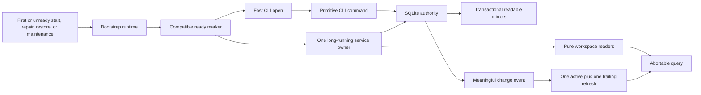
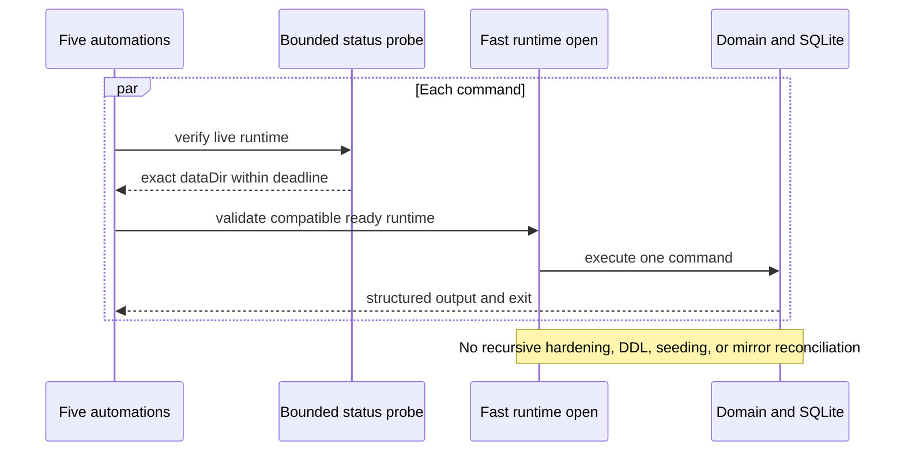
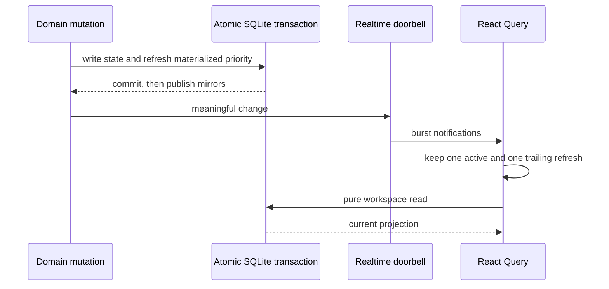
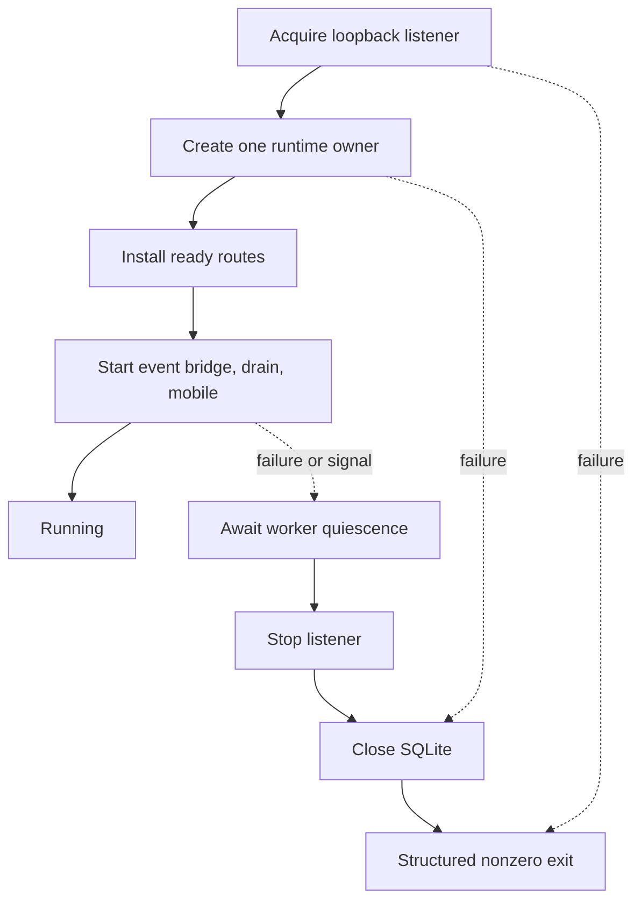

# perf: restore Tend runtime responsiveness

## Goal Capsule

Make Tend feel immediate and dependable while five fifteen-minute feed automations, the Now browser surface, and ad hoc CLI work share one local runtime. A warm operator read should finish in seconds rather than minutes, realtime updates must converge without request pileups, and a failed duplicate start or stalled status probe must terminate without leaving hidden work behind.

This plan fixes the complete confirmed causal chain: repeated recursive permission and mirror work on every CLI invocation, write transactions inside workspace GETs, uncancelled realtime refetch fan-out, background resources acquired before the HTTP listener, and a nominally timed status preflight that can keep the process alive. SQLite authority, readable mirrors, queue ownership, capability-token secrecy, identity checks, approvals, `action:verify`, existing automation cadence, backup compatibility, and packaged-binary behavior remain load-bearing.

Execution occurs on an isolated branch rooted at the current deployable Tend commit. The existing dirty `life-control-plane` checkout is user-owned and must not be staged or rewritten. The implementation is complete only after source tests, production-scale latency tests, packaged-binary smoke, installation into a backed-up live runtime, and browser verification all pass.

## Product Contract

### Problem

Tend’s Now screen currently appears to make 338 KB API calls that remain pending for 18–21 minutes. The transfer itself is not the delay. Five feed automations issue multiple CLI commands every fifteen minutes; each process recursively hardens and reconciles a runtime containing thousands of records, while browser GETs acquire write transactions and realtime events start unabortable full-workspace refetches. Duplicate starts and stalled preflights can outlive their intended failure, adding more contention.

The result is a control plane the operator cannot trust to respond when checked. A partial UI workaround would leave feed agents slow and process leaks intact, so the requested outcome requires repairing every confirmed layer.

### Actors

- **Operator:** opens `/now`, acts on cards, and expects visible state to refresh promptly without manual reloads.
- **Feed automation:** runs a bounded list/claim/collect/complete loop through the installed CLI and must retain exact feed and home-task ownership.
- **Tend service:** owns the canonical long-running runtime, browser API, realtime stream, mirror publication, and background workers.
- **Packaged CLI process:** performs one command against an already bootstrapped runtime, reports bounded failures, and exits without lingering transport or database handles.

### Requirements

- **R1 — Warm CLI responsiveness.** A warm packaged read-only CLI command has p95 latency at or below 1 second over twenty runs. Five simultaneous warm read-only commands have p95 latency at or below 2 seconds, maximum latency at or below 3 seconds, and every process exits.
- **R2 — Explicit bootstrap versus fast open.** Schema migration, legacy filesystem import, full mirror reconciliation, default seeding, and comprehensive permission repair run only in bootstrap or explicit maintenance paths. A fast steady-state open validates an existing compatible runtime and constructs repositories without recursive tree walks, DDL/migration writes, mirror reconciliation, or seed churn.
- **R3 — No data or security regression.** SQLite remains authoritative; first-run and legacy mirror import still work; committed mutations still publish readable mirrors atomically; owner-only permissions apply to newly created or written paths; backup/import and forward-only schema guards remain intact.
- **R4 — Pure workspace reads.** Authenticated workspace GETs and `workspace:now`, `workspace:coverage`, and `workspace:priority` CLI reads do not evaluate priority, enter a mutation transaction, append ledger/events, reconcile mirrors, or modify runtime metadata.
- **R5 — Current canonical ranking.** Every mutation that changes a commitment priority input updates the persisted commitment projection atomically before the mutation becomes visible. Startup or explicit maintenance can deterministically rebuild it. Attention-only cards continue to derive rank purely from stored card priority, status, and wall-clock inputs during a read; they never acquire commitment-only ledger semantics. Time-dependent commitment thresholds refresh at an owner-scheduled boundary, while attention-only visibility and coverage remain pure calculations.
- **R6 — Efficient workspace slices.** `/api/workspace/now`, `/coverage`, and `/priority` read only the state required for that slice. `/api/workspace` composes the same canonical slices without serial duplicate reconstruction. CLI and browser return equivalent IDs, ordering, explanations, ownership, and coverage from the same database state.
- **R7 — Abortable, coalesced realtime refresh.** Query functions propagate React Query’s `AbortSignal` into fetch. A burst of twenty change events in 100 ms creates at most one active request per query key and one trailing refresh, aborts superseded work, preserves explicit post-mutation refresh, and begins the final refresh within 250 ms after the burst. Existing token-rotation behavior remains unchanged.
- **R8 — Meaningful realtime only.** Healthy no-change heartbeats do not trigger a workspace refetch. Each committed visible-state transition advances an authoritative workspace generation for its affected slice; CLI-originated and HTTP-originated mutations publish that same generation exactly once, while no-op/liveness operations do not advance it. The event bridge deduplicates by generation, and a coalesced client eventually displays the latest committed generation.
- **R9 — Deterministic service lifecycle.** Foreground start creates exactly one runtime owner, acquires the listener before recurring workers start, and exposes readiness only afterward. Every partial-start failure and signal-driven shutdown stops and awaits workers, stops the listener, and closes SQLite exactly once in reverse ownership order.
- **R10 — Prompt duplicate-start failure.** Starting a second foreground service on an occupied port exits nonzero within 1 second, starts zero background workers, and performs no runtime writes after failure.
- **R11 — Hard CLI preflight deadline.** A status probe that connects but never produces headers or a body is force-destroyed. The CLI process exits within 1 second for a 500 ms deadline and does not fall through to a heavy local bootstrap or retain a socket.
- **R12 — Automation and queue invariants.** The five existing fifteen-minute automations retain their IDs, cadence, exact feed/home-task routing, queued-plus-working visibility, claimant replay, lane checks, token redaction, one-wake-per-transition behavior, and external-action safety gates.
- **R13 — Observable performance proof.** A privacy-safe live profile captures or exceeds cardinality, byte-size distribution, directory depth, WAL state, and the five-automation command mix for feeds, sources, runs, attempts, sweeps, events, cards, ledgers, mirrors, and database files. A generated fixture matching that profile reports bootstrap, warm single-command, five-way burst, workspace GET, black-hole preflight, occupied-port, and SSE-burst results with median, p95, maximum, exit status, and resource-cleanup assertions; divergence invalidates the proof. Warm authenticated `/api/workspace` p95 is at most 750 ms idle and at most 2 seconds during five concurrent warm CLI reads. Persisted receipts contain generated-data timings, counters, exit status, and redacted assertions only—never live stdout, claim results, identity observations, local tokens, execution grants, source content, or approval artifacts.
- **R14 — Safe personal release.** The repaired binary passes the repository’s full gates, is packaged as the next personal prerelease, is installed only after an integrity-checked owner-only backup, preserves a compatible rollback pair, and is verified against the installed live service and the existing Now page. The backup uses no-follow private paths outside cloud-synchronized folders, excludes ephemeral process secrets, and is deleted after seven successful days on the repaired release unless a rollback investigation is still open.
- **R15 — Stable command modes and inputs.** Public/internal command names, JSON/stdout/stderr/exit shapes, client-side `--*-file` resolution, validation messages, payload bounds, and idempotency remain compatible. Normal agent commands use fast open; explicit bootstrap, repair, backup, import, doctor, and health paths retain their documented maintenance or diagnostic behavior. An explicit isolated `ATTENTION_HOME` may use fast open without a service only after that home was bootstrapped.

### Key Flows

- **F1 — Five automations wake together:** each performs health and queue commands against one warm runtime. Commands validate the live runtime, avoid bootstrap/reconciliation, serialize only genuine mutations, finish within R1, and preserve queue semantics.
- **F2 — Operator opens Now during automation work:** a pure workspace read proceeds without requesting `BEGIN IMMEDIATE`; the UI renders current materialized priority plus live card/coverage state within the R13 budget.
- **F3 — Realtime burst:** several mutations commit close together. Realtime acts as a doorbell, the browser keeps one active refresh plus one trailing refresh, cancelled network work is actually aborted, and the final state appears.
- **F4 — Priority-affecting mutation or time boundary:** commitment, ownership, status, rule, or correction state changes. The mutation transaction refreshes the projection once. The owner service records and schedules the next deterministic due-band/imminence boundary and refreshes then; later GETs read without writing.
- **F5 — Fresh or legacy runtime starts:** bootstrap repairs permissions, migrates schema, imports filesystem-only legacy state, reconciles mirrors, seeds defaults, and marks the runtime ready. Later CLI opens validate that ready state and skip maintenance work.
- **F6 — Duplicate foreground start:** listener acquisition fails before event polling, autodrain, or mobile sync begins. Acquired resources close in reverse order, the process returns a structured nonzero failure, and no hidden process remains.
- **F7 — Stalled status server:** the preflight connects to a black-hole socket. The deadline destroys request and socket, the CLI emits its bounded result, and the process exits.
- **F8 — Release cutover:** an isolated production-scale home proves the package first; the live runtime is backed up; the new package starts; all automation command paths and `/now` are verified; rollback retains compatible binary/data pairs.
- **F9 — Service restarts during a wake:** existing command-specific inspection and idempotent replay behavior remains unchanged. Regression tests prove that transport loss does not duplicate a claim, run, completion, ledger entry, or approval transition; this repair does not introduce a new cross-command ambiguous-outcome protocol.

### Acceptance Examples

- **AE1:** Given a bootstrapped generated runtime that matches or exceeds the current privacy-safe live profile across all R13 dimensions, twenty warm `workspace:now` invocations meet R1 and do not change database metadata or mirror mtimes.
- **AE2:** Given filesystem-only legacy cards and sources, bootstrap imports them once; a subsequent fast open preserves them and performs no mirror reconciliation.
- **AE3:** Given repeated authenticated workspace GETs, priority-ledger count, event count, database metadata, projection contents, and mirror mtimes remain unchanged.
- **AE4:** Given every rank-affecting mutation class, the next pure GET returns its new rank or lifecycle state without an explicit evaluation request.
- **AE5:** Given twenty SSE changes in 100 ms while a workspace request is in flight, the old request receives an abort, no more than one trailing request starts, and the trailing response becomes visible.
- **AE6:** Given an already bound port, a packaged second start exits nonzero within R10 and process inspection shows no surviving Tend child, timer-driven CPU use, or post-failure writes.
- **AE7:** Given a server that accepts the CLI status connection and never replies, the packaged process meets R11 and leaves no connected socket.
- **AE8:** Given normal work queue operations after the optimization, list, claim, replay, complete/fail/block, approval digest, identity mismatch, and `action:verify` regression tests remain unchanged.
- **AE9:** Given the installed live package, the five existing automations still reference the installed release and a full quiet cycle completes without minutes-long pending workspace requests.

### Scope Boundaries

**In this goal**

- Runtime bootstrap/fast-open separation, schema-ready markers, permission maintenance, and mirror compatibility.
- Workspace read-model purity and slice-specific reads.
- Browser request cancellation and realtime coalescing.
- Foreground service resource ownership and awaited cleanup.
- Bounded CLI status transport and process-exit behavior.
- Production-scale tests, performance reporting, package/install, automation and browser verification.

**Later**

- Remote or multi-host Tend daemons.
- Adaptive automation cadence, distributed scheduling, or provider collection changes.
- Patch-stream realtime protocols or a normalized workspace cache beyond the current SQLite projection.
- General observability export beyond local benchmark/diagnostic output.

**Never**

- Dropping readable mirrors, bypassing first-run/legacy import, weakening read/mutation tokens, allowing feed threads to start or kill services, changing lane ownership, exposing capability tokens in reads, or performing an external mutation without exact approval, fresh identity, and `action:verify`.

## Planning Contract

### Context and Research

- `server/runtime.ts`, `server/sqlite.ts`, and `server/store.ts` currently combine permission repair, schema work, repository construction, seeding, and mirror reconciliation. Mirrored repository `init()` imports filesystem-only records and rewrites primary records back to mirrors, so that behavior must remain available in bootstrap rather than being deleted.
- `server/routes/api.ts` currently calls `refreshWorkspacePriorities()` in every workspace GET. That method enters `serializeAtomic()` and SQLite `BEGIN IMMEDIATE`, even when evaluation finds no changed row.
- `server/store.ts` builds the complete workspace aggregate for each slice route. Dedicated slice readers can retain one canonical projection while avoiding unrelated ledger/card/source work.
- `src/app/api.ts` drops caller cancellation context, while `ControlPlaneApp` invalidates the full workspace query after every SSE event and action. React Query can cancel only when its signal reaches the underlying fetch.
- `server/cli/start.ts` opens and discards a SQLite handle before importing a server module that opens a second runtime. `server.ts` starts its event bridge before binding the port, and normal shutdown does not close SQLite.
- `server/cli/runtimeGuard.ts` uses an aborting fetch, but a live black-hole probe demonstrated that process lifetime can greatly exceed the advertised deadline. A transport deadline must destroy the underlying request/socket.
- `docs/solutions/security-issues/two-agent-work-queue-lane-safety.md` records a directly relevant failure: periodic presence events on the visible notification pipeline caused perpetual SSE-driven workspace refetches. Notification is for meaningful transitions, not liveness noise.
- No external research is required. The bug is reproduced locally, repository contracts are explicit, and the repair can be locked through black-box lifecycle and performance tests without adding a dependency.

### Key Technical Decisions

- **KTD1 — Fix the complete chain, not one symptom.** `session-settled:user-directed; rejected: diagnosis-only, cadence-only, or UI-only mitigation.` Runtime, read model, browser, lifecycle, and timeout repairs land together because any remaining layer can recreate the same user-visible stall.
- **KTD2 — Two runtime initialization modes with a crash-safe readiness protocol.** Bootstrap/maintenance owns migrations, recursive permission repair, mirror import/reconciliation, and seeds. Bootstrap stores state, schema compatibility, and a bootstrap-generation constant in SQLite metadata: it marks the state incomplete before maintenance and publishes `ready` as its final atomic database step only after import, seeds, permission repair, and reconciliation succeed. Fast open requires matching schema and bootstrap generation plus `ready`, validates without DDL or metadata churn, constructs repositories, and preserves mirror-on-mutation behavior. A missing, stale, or incomplete marker, new schema, explicit repair, restore, or first start reruns idempotent bootstrap.
- **KTD3 — Prefer fast local SQLite access, subject to an early reversal gate.** Existing CLI commands remain primitive tools and retain their structured contract. U1/U2 measure packaged process startup, bounded preflight, concurrent SQLite open/read/close, WAL behavior, and filesystem locking independently. Fast local open is accepted only if it meets R1 with at least 20% headroom on the R13 fixture. If it fails that gate after maintenance work is removed, implementation must route the same primitive command contracts through authenticated per-command service endpoints; it must preserve names, payloads, ownership, idempotency, and isolated-home offline behavior and must not introduce a heartbeat macro.
- **KTD4 — Persist priority on writes and deterministic time boundaries.** Rank inputs controlled by mutations refresh the materialized projection inside the owning transaction. The service computes the next due-band or configured imminence boundary, schedules one refresh there, and reschedules after relevant changes; startup and explicit evaluation repair missed boundaries. Coverage age and presentation-only wall-clock fields remain pure read calculations.
- **KTD5 — Prefer uncached canonical slice reads, with a measured fallback.** Slice readers and request-level parallelism remove redundant work. A TTL cache is rejected because separate CLI processes mutate the database and coverage/due state changes with time. If canonical slice reads still miss R13 after U3, implementation must measure a transactionally advanced workspace/slice generation and generation-keyed server cache before changing the budget; cached data may never outlive its canonical generation.
- **KTD6 — Realtime is a generation-aware coalesced doorbell.** Visible mutation commits transactionally advance the affected slice generation. CLI and HTTP mutation paths publish that generation through one notifier; the event bridge relays but does not duplicate a generation. No-op and liveness writes prove no generation advance. One query-key refresh may run at a time with one remembered trailing target generation; a sustained stream keeps the trailing target at the newest observed generation until a refresh completes with no newer generation. Signals propagate to fetch, unmount cancels timers and requests, and explicit mutation refreshes are preserved.
- **KTD7 — Lifecycle resources have one owner and awaited disposal.** A lifecycle factory acquires the listener before recurring workers, records each resource, and disposes in reverse order on failure or shutdown. Stop operations are idempotent and await in-flight polls before SQLite closes. This repair does not add a second cross-process ownership protocol beyond listener acquisition.
- **KTD8 — Deadlines own the transport.** The status helper uses an explicit total timer that destroys the request and socket across connect, header, and body stalls. Catching an abort without releasing handles is not success.
- **KTD9 — Optimize without crossing safety boundaries.** Read tokens, mutation tokens, feed/card ownership, queue/lane enforcement, capability-token redaction, execution grants, connector identity, and approval verification do not move into client-side shortcuts or benchmark-only exceptions.
- **KTD10 — Isolate shipping from user-owned WIP.** The performance change is developed and reviewed on this clean worktree. Live verification may apply the reviewed patch to the current personal-release tree, but unrelated `.8–.14` work is never staged into the performance commit or PR.
- **KTD11 — Valid SQLite wins; mirrors are durable best-effort derivatives.** Mirrors seed an empty or explicitly recovered runtime during bootstrap; a valid nonempty database is authoritative and rewrites stale mirrors. Live mirror edits are not imported by fast open. If post-commit mirror publication fails, SQLite records a durable `mirror_repair_required` health state, the mutation remains authoritative, and service maintenance retries reconciliation; Tend never claims the filesystem write rolled back the committed database.
- **KTD12 — Authoritative commit before response and notification.** A mutation, required projection update, and affected workspace generation commit before success is returned or realtime is notified. Post-commit mirror publication is attempted before response when practical, but its failure follows KTD11 rather than changing the committed result; semantically unchanged operations neither advance a generation nor notify. Existing command-specific inspection and replay semantics remain unchanged and receive regression coverage.
- **KTD13 — The installed artifact is tied to reviewed source.** The composite personal release is built from a recorded source manifest, then the archive and executable digests/signatures are captured and verified after installation. Security-sensitive queue, identity, token-redaction, and approval checks run against that exact packaged artifact before automation paths change.

### High-Level Technical Design

> Directional only. Exact interfaces remain implementation-owned.

### Sequencing

Characterization and performance harnesses land first. Runtime modes precede CLI adoption; write-side projection completeness precedes removal of GET refreshes; abort propagation precedes realtime coalescing; lifecycle ownership precedes package duplicate-start tests. Full package and live verification run only after all safety regressions pass.

### Browser Continuity Contract

| State | Visible content | Action posture | Status and recovery |
|---|---|---|---|
| first load | loading surface only | disabled | semantic busy state; failure offers keyboard-accessible retry |
| background refresh while connected | last-known-good Now content | enabled except the item with a mutation in flight | no per-event announcement; selection and focus remain stable |
| reconnecting after a service restart | last-known-good content marked as reconnecting | mutating actions disabled until one fresh read succeeds | one polite transition; preserve the existing token-rotation behavior |
| offline or retry exhausted | last-known-good content visibly stale | mutating actions disabled | persistent status with keyboard-accessible retry |
| mutation request pending | current content plus pending state on the exact item | submitted CTA disabled against duplicate clicks | announce once that the action is being queued |
| mutation committed, refresh pending | current content plus committed/refreshing state | committed CTA remains disabled | success is distinct from refresh status |
| mutation committed, refresh failed | last-known content marked stale and exact action marked committed | committed CTA remains disabled until canonical inspection | state says the action succeeded but display refresh failed; retry refresh, not mutation |
| mutation outcome ambiguous | no success claim | exact action disabled | require canonical work/card inspection before retry |
| selected item reordered | same stable item remains selected | unchanged | focus and Dock target stay with the stable ID |
| selected item removed | local unsent text and edits remain in a recovery buffer | no action against removed owner | announce once, select the next deterministic item, and offer recoverable text |
| selected item changed remotely while locally edited | last confirmed server version plus local edits | save/action waits for conflict resolution | present the conflict without discarding either version |

Background refresh preserves editable-card state and Dock text by stable owner/card identity. Results merge untouched fields; a conflicting server change enters the explicit conflict state. The refreshing region uses `aria-busy` or equivalent semantics, meaningful connection/action failures use restrained polite announcements, event bursts never announce per event, and focus is not reset by reordered results.

## Implementation Units

### U1. Establish production-scale characterization and performance contracts

**Goal:** Make every confirmed defect reproducible with deterministic isolated fixtures and measurable exit criteria.

**Requirements:** R1, R7, R10, R11, R13

**Files:** `test/runtime.test.ts`, `test/api-routes.test.ts`, new lifecycle/realtime performance tests, `scripts/smoke-binary.ts`, optional local benchmark helper under `scripts/`

**Approach:** Capture a privacy-safe profile of the live runtime before generating data: row counts, byte-size distributions, directory depth/file counts, WAL and database sizes, and the actual five-automation command concurrency across every dimension named by R13. Build an isolated five-feed fixture that matches or exceeds each dimension and reject benchmark runs whose generated profile diverges. Separate cold bootstrap from warm measurements. Capture recursive-walk/mirror-write/transaction/worker-start counts in addition to wall time so tests prove causality rather than depend only on machine speed. Measure fast-open startup, preflight, SQLite open/read/close, WAL, and locking components separately to enforce KTD3’s reversal gate.

**Test scenarios:**

- Warm single and five-way CLI bursts record median, p95, max, exit code, and remaining processes.
- A black-hole HTTP server accepts a connection without headers or body.
- An occupied port rejects a second foreground process and records worker/runtime side effects.
- Twenty realtime changes occur during an in-flight request.
- The generated fixture is compared to the recorded redacted live profile and fails closed when any load-bearing dimension is smaller.
- Fast-open components report enough independent timing to decide KTD3 before adopting the architecture.

**Verification:** The pre-fix characterization fails for the intended reason; thresholds and counters remain stable enough for CI and packaged smoke.

**Dependencies:** None.

### U2. Separate bootstrap/maintenance from fast runtime open

**Goal:** Remove repeated filesystem and schema maintenance from steady-state CLI commands without sacrificing first-run, legacy, mirror, permission, or schema safety.

**Requirements:** R1, R2, R3, R12, R15

**Files:** `server/runtime.ts`, `server/sqlite.ts`, `server/store.ts`, mirrored repositories as needed, `server/cli/shared.ts`, `server/cli/operator.ts`, runtime and permission tests

**Approach:** Name and isolate runtime phases, implement KTD2’s SQLite readiness protocol, and make fast open reject unprepared or newer runtimes with structured remediation. Bootstrap performs the existing import/reconciliation and comprehensive hardening once; fast open does targeted directory/file safety, opens without DDL/metadata writes, skips repository `init()`, and still publishes mirrors for genuine mutations. Remove lazy `store.init()` from steady-state reads. Ordinary fast CLI close does not checkpoint or truncate WAL; deliberate service shutdown, bootstrap/maintenance, and backup own checkpoint policy. Mirror failure records KTD11’s durable repair state. Apply KTD3’s 20%-headroom decision gate before binding all normal CLI commands to fast local open; if falsified, keep the primitive commands but use authenticated per-command service transport.

**Test scenarios:**

- Empty home bootstraps defaults and owner-only permissions.
- Filesystem-only legacy data imports and mirrors once.
- Warm fast opens perform no recursive walk, DDL, metadata update, seed write, or reconciliation.
- Fast CLI close performs no WAL checkpoint/truncation; service/maintenance checkpoint remains safe with concurrent readers and writers.
- Current and newer schema markers choose the correct fast/fail/bootstrap path.
- Default-home, explicit-home, maintenance, diagnostic, and file-backed command modes follow an explicit compatibility matrix.
- Concurrent commands preserve queue, mirror, rollback, and claimant semantics.

**Verification:** R1 and AE1–AE2 pass against the production-scale fixture; backup/import and runtime permission suites remain green.

**Dependencies:** U1.

### U3. Make workspace projections mutation-owned and reads slice-specific

**Goal:** Ensure browser and CLI workspace reads never contend as writers or rebuild unrelated aggregate state.

**Requirements:** R4, R5, R6, R8, R12

**Files:** `server/domain.ts`, `server/store.ts`, `server/routes/api.ts`, `server/cli/operator.ts`, workspace projection repositories, API/control-plane tests

**Approach:** Produce an exhaustive mutation-to-priority-input matrix as a reviewed U3 artifact. For commitment-linked cards, centralize projection refresh at owning domain mutation boundaries and record the next due-band/imminence boundary for one service-owned scheduled refresh. For attention-only cards, preserve pure read-time evaluation from stored priority, status, pass/visibility, rule, and due/imminence inputs without creating commitment ledger rows. Keep deterministic startup/maintenance repair. Introduce canonical Now/Coverage/Priority readers and compose the aggregate from them. Remove priority refresh from GET and read-only CLI paths. Add the authoritative slice-generation contract from KTD6 at the same mutation boundaries, including proof that no-op/liveness paths do not advance it and that the event bridge cannot duplicate direct notifications. Preserve loopback read tokens and mutation gates unchanged. If uncached reads still miss R13, execute KTD5’s measured generation-keyed cache fallback before relaxing any budget.

**Test scenarios:**

- Repeated reads cause no transaction, evaluation, ledger/event append, mirror write, or metadata change.
- Each commitment lifecycle, owner, completion, rule activation/approval, and other rank-input mutation updates the next read atomically.
- Every row of the U3 mutation-to-input matrix has a focused test, including attention-only card upsert/status/pass/visibility/priority changes.
- Due-band and configured imminence crossings refresh once at the scheduled owner boundary; startup repairs a boundary missed during downtime. Coverage freshness changes through pure calculation.
- Slice and aggregate results retain identical item IDs, ordering, explanation, owner, and coverage semantics.
- No-change agent presence and heartbeat operations emit no user-visible refresh.
- Each visible mutation advances only its affected slice generations once; direct and bridged notifications converge on that generation without duplicate invalidation.
- A sustained notification stream keeps refreshing through the newest generation and stops only after a refresh completes with no newer generation.

**Verification:** AE3–AE4 pass; warm authenticated `/api/workspace` p95 is at most 750 ms idle and at most 2 seconds during five concurrent warm CLI reads.

**Dependencies:** U1, U2.

### U4. Propagate cancellation and coalesce realtime refreshes

**Goal:** Prevent browser request accumulation while guaranteeing a final current view.

**Requirements:** R7, R8

**Files:** `src/app/api.ts`, `src/workspace/ControlPlaneApp.tsx`, `src/App.tsx`, `src/mind/OnYourMindPage.tsx`, `src/state/realtime.tsx`, frontend realtime/query tests

**Approach:** Preserve caller `RequestInit` and auth headers while passing the query signal to fetch. Implement reusable one-active-plus-one-trailing scheduling shared by SSE, reconnect, card edit, and post-mutation triggers, with unmount cleanup and a target generation that advances during sustained streams. Preserve existing token-rotation behavior without adding a new retry protocol. Implement the Browser Continuity Contract so mutation and refresh outcomes remain separate, exact CTAs cannot be retried while canonical state is uncertain, selection/focus and unsaved text survive background updates, and conflicts preserve both versions. Do not hide true stale/action errors behind cancellation.

**Test scenarios:**

- Superseded and unmounted queries abort the underlying fetch.
- A twenty-event burst produces one active and at most one trailing refresh.
- A change during the trailing refresh still yields one final current response.
- No-change periods issue no extra fetch; explicit mutation refresh still runs.
- Feed, Now, and On Your Mind consumers follow the same cancellation contract.
- Existing service-restart and token-rotation behavior does not regress.
- Initial loading, background refresh, reconnect, offline, committed-but-stale, ambiguous, recovered, selection removal, and edit-conflict states match the Browser Continuity Contract.
- Focus/active-item preservation, semantic busy state, restrained live announcements, and keyboard retry pass accessibility assertions; SSE bursts produce no announcement storm.

**Verification:** AE5 and the R7 timing/counter budget pass in browser-unit tests and live DevTools shows no growing pending-workspace queue.

**Dependencies:** U1, U3.

### U5. Give the service and preflight deterministic resource lifecycles

**Goal:** Ensure failed starts, shutdowns, and stalled probes terminate promptly with no hidden workers or handles.

**Requirements:** R9, R10, R11, R12

**Files:** `server.ts`, new lifecycle module if useful, `server/cli/start.ts`, `server/cli/runtimeGuard.ts`, optional `server/cli/http.ts`, `server/realtime/feedEventBridge.ts`, `server/dispatcher.ts`, `server/mobile/sync.ts`, lifecycle and CLI subprocess tests

**Approach:** Remove the discarded pre-start SQLite handle. Acquire the listener before recurring workers, expose readiness only after bootstrap/projection recovery, maintain one runtime owner, and make cleanup idempotent and awaited. Give polling workers and scheduled priority refresh a quiescence contract. Replace the fetch-only status timeout with a total-deadline loopback helper that destroys request/socket and cannot bootstrap on a stalled live endpoint. Preserve existing command-specific response-loss inspection and replay behavior through regression tests; do not invent a new cross-command outcome protocol.

**Test scenarios:**

- Occupied port starts no workers and exits without runtime churn.
- Failure after each acquisition point disposes all earlier resources in reverse order.
- Repeated close and signal shutdown await in-flight polls before SQLite closes.
- Connect, header, and body stalls all meet the process-lifetime deadline.
- Normal status, mismatch, explicit isolated runtime, and service-unavailable responses remain structured.
- Existing response-loss handling for representative idempotent and non-idempotent mutations yields its established inspect/replay behavior without duplicates.

**Verification:** AE6–AE7 pass in source subprocess tests and packaged smoke; process/socket inspection finds no survivors.

**Dependencies:** U1, U2, U3.

### U6. Release, install, and verify the repaired personal build

**Goal:** Prove the optimized source is the code actually used by Tend, its automations, and the Now browser surface.

**Requirements:** R12, R13, R14

**Files:** `package.json`, `CHANGELOG.md`, `docs/ARCHITECTURE.md`, `docs/DATA.md`, `docs/DEVELOPMENT.md`, `docs/RELEASING.md`, `scripts/smoke-binary.ts`

**Approach:** Document runtime modes, pure reads, realtime/lifecycle guarantees, diagnostics, and rollback. Record the exact composite source manifest, build/package the next prerelease from it, capture archive and executable identity, and verify an isolated restored production-scale runtime. Export the live runtime to an owner-only no-follow path outside synchronized folders, verify backup integrity, install and attest the reviewed composite release without staging unrelated WIP, update all five automation executable paths only if the versioned install path changes, and verify the installed service. Retain the backup for seven successful days, then delete it unless a rollback investigation remains open.

**Test scenarios:**

- Full source, build, binary, smoke, package, and audit gates pass.
- Isolated package meets all R13 budgets and migration/restart checks.
- Installed version/status/health report the expected release and runtime.
- Installed archive and executable digests/signatures match the artifact built from the recorded composite source manifest.
- Every automation command path completes against its exact feed/home task.
- Live `/now` loads and refreshes without accumulating pending workspace requests.
- Prior binary plus pre-migration backup remains a documented rollback pair.

**Verification:** AE8–AE9 pass; the installed process and automation definitions reference the new package; no user-owned unrelated diff appears in the performance commit.

**Dependencies:** U2, U3, U4, U5.

## System-Wide Impact

### Data lifecycle

Bootstrap and explicit maintenance or recovery remain the only paths that can import legacy mirrors into SQLite or comprehensively rewrite derived mirrors. Fast open must never reinterpret a mirror as authority. Mutation-time mirror publication and durable repair behavior stay inside the coordinator defined by KTD11. Readiness metadata is a bootstrap-generation contract in addition to, not a substitute for, the SQLite schema version.

### Failure propagation

An unready, mismatched, newer-schema, unavailable, or stalled runtime yields a bounded structured CLI error before work is claimed or mutated. A server acquisition failure tears down local resources and exits nonzero. Browser cancellation is silent only for superseded requests; domain or stale-evidence errors remain visible.

### Security and privacy

Loopback origin, aggregated read token, mutation token, capability-token redaction, private filesystem modes, connector identity, and `action:verify` are unchanged. Benchmarks use generated fixtures under isolated `ATTENTION_HOME` and never copy live evidence into the repository or logs.

### Agent and automation parity

Command names and JSON shapes remain additive and stable. Queue-first list/claim ordering, exact feed/task routing, claim replay, token handling, failed-attempt recording, and action verification remain the same. Performance work must not collapse primitive commands into a hidden automation macro.

### Operational rollout

The existing dirty personal-release checkout remains intact. The clean performance branch produces the reviewable commit/PR; the reviewed patch is then composed with the current personal release only for package/install verification. A live backup and prior compatible package are retained before cutover.

## Risks and Dependencies

- **Legacy state stranded by fast open:** mitigate with explicit ready/schema guards and first-run/filesystem-only import regression tests.
- **Stale priority after removing GET refresh:** mitigate with a mutation-to-input matrix, atomic per-mutation tests, deterministic startup repair, and an explicit evaluation command.
- **SQLite closed under an in-flight poll:** mitigate with awaited worker quiescence and reverse-order cleanup tests.
- **Flaky performance gates:** use isolated production-scale fixtures, warm/cold separation, counters plus wall time, and generous absolute budgets tied to the observed minutes-long failure.
- **Cross-process change missed by a cache:** reject long-lived TTL response caching; read SQLite canonical state for every request.
- **Cancellation masks an actionable error:** suppress only recognized aborts caused by supersession/unmount; preserve all server errors.
- **Live package regresses newer personal WIP:** build the PR independently, then verify a deliberate composite package based on the current personal prerelease; never install the older branch alone over live state.
- **Time passes without a mutation:** schedule the earliest deterministic priority boundary in the owner service and repair missed boundaries on startup.
- **Transport response lost after commit:** preserve stable IDs and command-specific replay/inspection semantics; never auto-retry a non-idempotent mutation.
- **Tooling dependency:** Bun, pnpm, native signing, and local automation update capabilities must remain available for package/install verification.
- **Verification or rollback artifacts disclose sensitive state:** persist generated-data timings and redacted assertions only; keep the rollback backup owner-only outside synchronized storage and enforce its retention deadline.

## Open Questions

### Resolved during planning

- **Runtime ownership:** keep existing primitive CLI/domain behavior and use a guarded fast local open; do not introduce a new heartbeat macro or remote daemon.
- **Caching:** use pure slice readers and request-level concurrency, not a long-lived workspace response cache.
- **Priority timing:** materialize mutation-controlled inputs and compute wall-clock-derived display/freshness purely at read time.
- **Automation cadence:** retain all five fifteen-minute schedules; cadence changes are not the fix.
- **Mirror edits:** mirrors are readability/recovery artifacts; explicit bootstrap/recovery may import them, while fast open never treats live edits as authority.

### Deferred, non-blocking

- Whether a later release should move every operator CLI command behind an authenticated service transport. This repair does not require that architecture and must first prove the fast-open contract.

## Verification Contract

### Source gates

- `pnpm install --frozen-lockfile`
- `pnpm typecheck`
- `pnpm lint`
- `pnpm test`
- `pnpm check`
- `pnpm build`

### Native release gates

- `pnpm tend:build`
- `pnpm tend:smoke`
- `pnpm tend:package`
- `pnpm audit`

### Behavioral and performance gates

- Run runtime, API, workspace, realtime client, service lifecycle, CLI contract, queue/lane, approval, identity, backup/import, and permission tests against isolated homes.
- Run the production-scale warm single, five-way burst, workspace GET under contention, black-hole preflight, occupied-port, and SSE-burst measurements and require R1, R7, R10, R11, and R13.
- Confirm repeated pure reads do not change the database metadata, ledger/event counts, projection, or mirror mtimes.
- Verify every row of the U3 mutation-to-priority-input matrix, including attention-only cards, and keep that matrix as AE4’s traceable source.
- Confirm the packaged executable—not a source runner—passes version, status, health, migration/restart, binary smoke, and process-exit checks.
- Confirm listener-first startup rejects an occupied-port duplicate before workers start and every partial-start/shutdown path releases acquired resources.
- Confirm scheduled priority boundary refresh, missed-boundary startup repair, generation-aware commit-before-notify ordering, file-backed inputs, and non-regression of existing token-rotation and response-loss replay behavior.
- In the live browser, preserve the existing Tend tab, verify `/now` content and CTA behavior, inspect Network for bounded workspace requests, and verify a realtime update without a growing pending queue.
- Inspect all five automation definitions after installation and run one exact queue-first command sequence per feed against the installed executable.
- Persist only redacted live-verification assertions; do not save live CLI stdout, claim responses, connector identities, tokens, grants, source content, or approval artifacts.
- Verify the owner-only backup path, modes, integrity, excluded ephemeral secrets, seven-day retention deadline, and the installed archive/executable identity against the recorded source manifest.

## Definition of Done

- Every requirement R1–R15 has an automated or live verification receipt.
- The warm CLI, concurrent CLI, workspace GET, SSE burst, duplicate-start, and black-hole budgets pass against production-scale data.
- First-run, legacy import, schema guard, mirror atomicity, permissions, backup/import, and rollback compatibility pass.
- Workspace GETs and read-only CLI commands perform no priority mutation or maintenance work.
- Every row in the exhaustive mutation-to-priority-input matrix produces an immediately current pure read or the specified scheduled-boundary refresh.
- Browser fetch cancellation and coalescing are proven in tests and live DevTools.
- The Browser Continuity Contract passes state, duplicate-action, edit-preservation, focus, screen-reader announcement, and keyboard-recovery tests.
- Failed duplicate starts and stalled preflights leave no process, worker, database, timer, or socket handle.
- Queue, lane, claimant replay, token redaction, approval, identity, and `action:verify` suites remain green.
- The next personal prerelease is built, packaged, installed after backup, reported by the live service, and referenced by all applicable automations.
- The installed executable is cryptographically tied to the recorded composite source manifest and the owner-only rollback backup has a verified retention/deletion record.
- The live Now page is responsive and one quiet automation cycle completes without minutes-long pending API calls.
- The performance branch contains only attributable plan/code/test/doc/release changes; unrelated user-owned WIP is absent.
- Experimental, abandoned, duplicate, and debug-only code introduced during the repair is removed.

## Execution Evidence

### Source and package gates

- `pnpm check`: 361 passed, 1 intentionally skipped external Supabase integration, 0 failed.
- `pnpm audit --prod`: no known vulnerabilities.
- `pnpm tend:build`: packaged macOS arm64 executable and least-privilege iMessage helper built.
- `pnpm tend:smoke`: packaged executable started, reported schema 17 and CLI contract 0.6, served the Tend UI, and exited cleanly.

### Production-scale performance receipt

The generated privacy-safe fixture exceeded the recorded live-profile minima with 8,000 source
runs, 8,000 source attempts, 4,000 sweep batches, 205 cards, 8,681 feed events, 250 priority-ledger
entries, a 57.2 MB SQLite database, a 106.7 MB runtime, and 12,459 files.

| Gate | Result | Budget |
|---|---:|---:|
| warm packaged CLI p95 | 158.8 ms | <= 1,000 ms |
| five-way packaged CLI p95 | 153.3 ms | <= 2,000 ms |
| five-way packaged CLI max | 153.3 ms | <= 3,000 ms |
| authenticated workspace GET p95 | 105.3 ms | <= 750 ms |
| workspace GET p95 under five CLI readers | 120.6 ms | <= 2,000 ms |
| black-hole CLI process lifetime | 552.7 ms | <= 1,000 ms |
| occupied-port process lifetime | 56.7 ms | <= 1,000 ms |
| Tend mutation-to-SSE propagation | 14.0 ms | <= 5,000 ms |
| trailing refresh start | 3.9 ms | <= 250 ms |

The realtime receipt also proved exactly two refreshes for a twenty-request burst, one maximum
active request, and one aborted superseded request. Fixture cardinality, exit-status, latency, and
resource-cleanup assertions all passed.

### Review-discovered repairs

- Mirror repair now keeps valid SQLite deletions authoritative instead of resurrecting stale files.
- Feed-event and priority generations commit and roll back atomically with their owning writes.
- Coverage selection uses bounded keyset pages and leaves no SQLite iterator or checkpoint lock.
- Failed scheduled-priority passes retry the failed refresh, not only the scheduling calculation.
- Realtime polling commits cursor snapshots atomically and detects removed feeds.
- Runtime replacement locks cover backup swap and service startup without a time-of-check gap.
- Runtime replacement lock ownership is published as one complete atomic record; concurrent
  same-home claims replay one durable capability token rather than minting competing authority.
- Browser actions fail closed during reconnect, stale cached data remains visible, stale read tokens
  rotate once, ambiguous mutations stay locked across navigation, and editable controls pause with
  the same canonical-state gate.
- SSE readiness and change frames keep actions gated until canonical refresh succeeds, query
  cancellation settles before the one trailing refresh starts, and unresolved drafts are not
  silently evicted.
- The SSE route now queues notifications into its own handler and wakes it immediately; an actual
  local stream regression and the packaged benchmark prevent the prior heartbeat-delayed delivery.
- Coverage receipts are selected in batched per-source windows, independent realtime cursors are
  snapshotted concurrently, and priority boundaries are rescheduled only for scheduling inputs.
- Mobile cloud shutdown checks cancellation before every local mutation and provider completion;
  if a worker cannot confirm shutdown, Tend reports failure and deliberately leaves SQLite open
  instead of closing it under live work. Dispatcher scans use bounded concurrency, app-server stream
  decoding preserves split UTF-8, and large card histories stay allocation-bounded.
- Explicit mirror repair rewrites stale mutable records and removes mirror-only state while keeping
  SQLite authoritative.
- The simplification pass applied two reuse improvements and four clarity/ownership improvements;
  it kept the tested server lifecycle owner intact rather than risk a behavior-only refactor before
  release, then applied all ten performance findings from the efficiency pass.

Live composite packaging, installation, automation-path update, and browser receipts are recorded
after the residual review gate passes.

## Sources and References

- `AGENTS.md`
- `CONTRIBUTING.md`
- `docs/ARCHITECTURE.md`
- `docs/DATA.md`
- `docs/DEVELOPMENT.md`
- `docs/RELEASING.md`
- `docs/plans/2026-07-21-001-feat-life-control-plane-plan.md`
- `docs/solutions/security-issues/two-agent-work-queue-lane-safety.md`
- `server/runtime.ts`
- `server/sqlite.ts`
- `server/store.ts`
- `server/domain.ts`
- `server/routes/api.ts`
- `server/routes/shared.ts`
- `server/cli/operator.ts`
- `server/cli/runtimeGuard.ts`
- `server/cli/start.ts`
- `server/realtime/feedEventBridge.ts`
- `src/app/api.ts`
- `src/state/realtime.tsx`
- `src/workspace/ControlPlaneApp.tsx`
